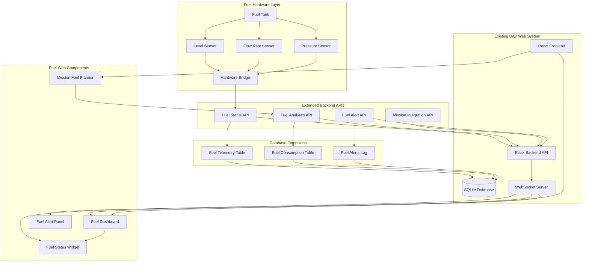
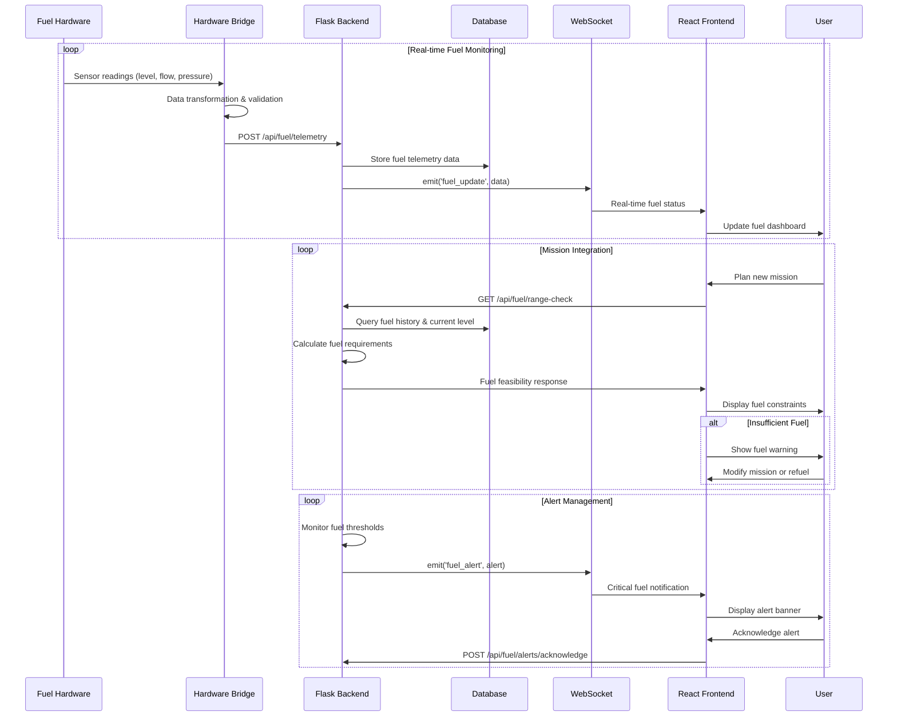
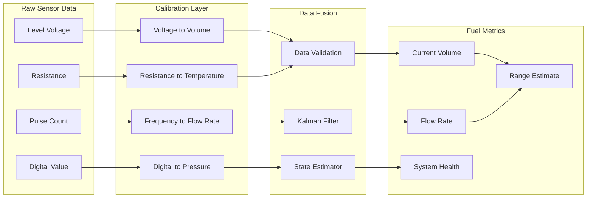
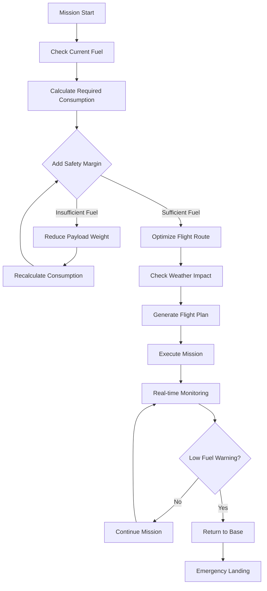
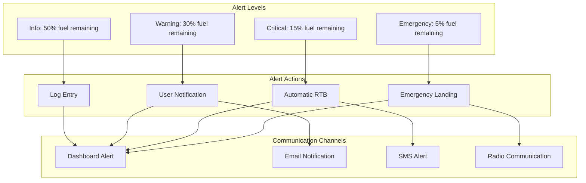
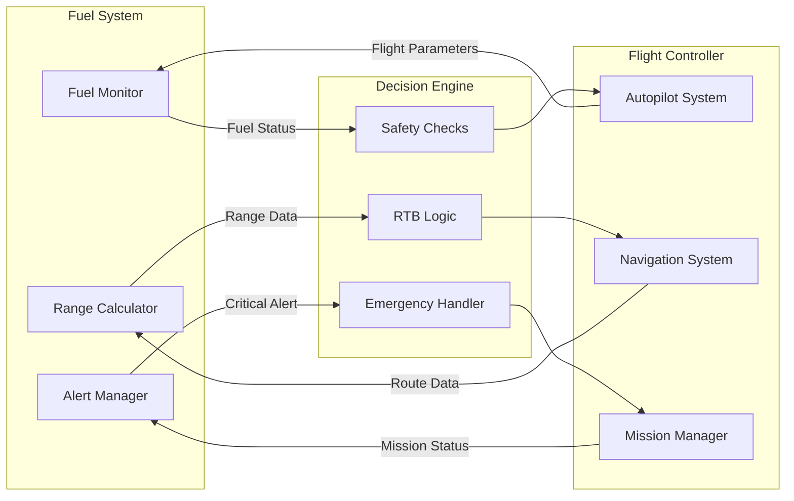
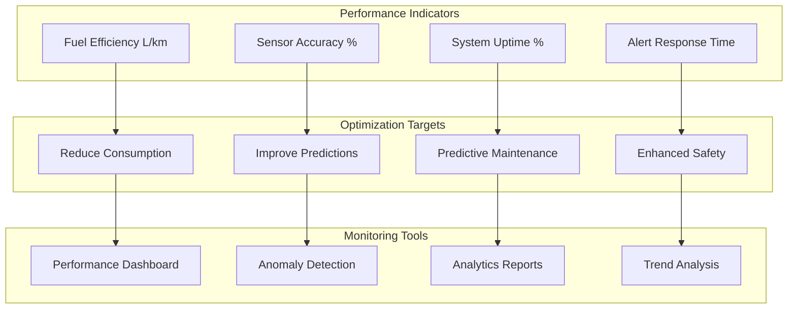
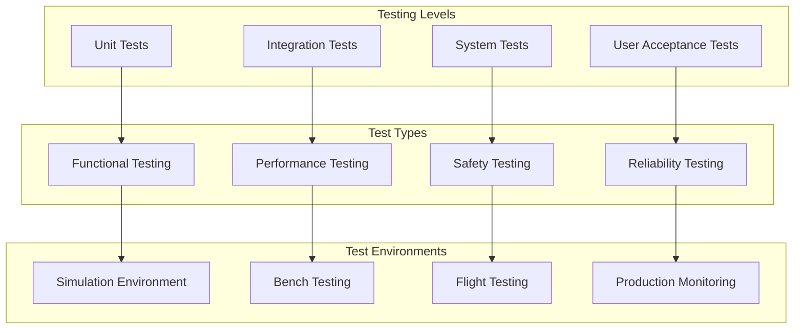
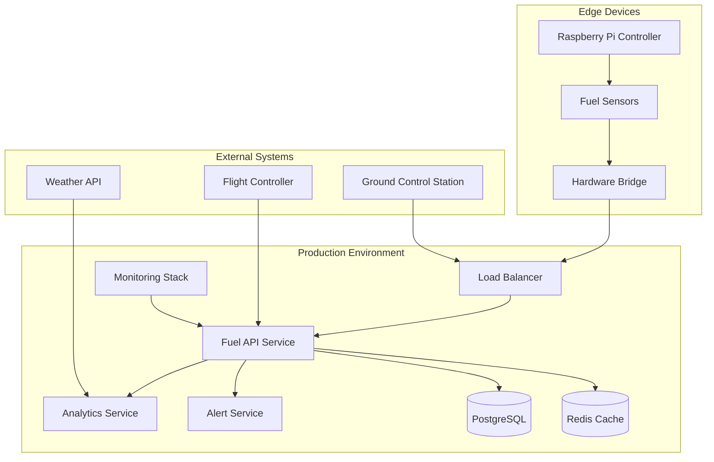
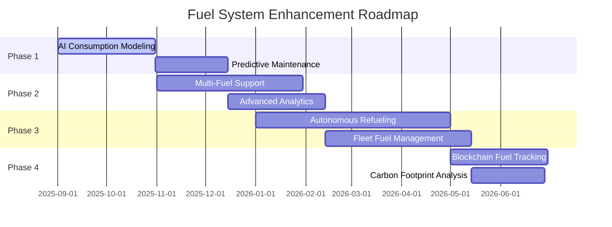

# UAV TAQ-25 Payload System - Web Visualization and Integration
## Preliminary Design Document

**Document ID:** UAVG5-WEB-PD-01  
**Version:** 1.0  
**Date:** 2025-08-31  
**Author:** EGH455 Group 5  

---

## 1. Executive Summary

The UAV TAQ-25 payload system web visualization and integration component serves as the comprehensive web-based control center for managing unmanned aerial vehicles, their payloads, missions, and real-time telemetry data. The system provides a complete React-based web application integrated with a Flask backend API to deliver professional-grade UAV fleet management capabilities through an intuitive web interface.

The web application provides five primary functional areas: UAV fleet management with complete CRUD operations and status monitoring, mission planning and control with waypoint management and real-time mission execution tracking, payload management with inventory tracking and assignment capabilities, real-time telemetry visualization with live data streaming and historical analysis, and comprehensive authentication system with role-based access control. The system architecture employs modern React with TypeScript for type safety, Material-UI for professional interface design, Flask-SocketIO for real-time communication, and SQLite database for reliable data persistence.

---

## 2. System Architecture

### 2.1 Web-Integrated Fuel System Architecture



### 2.2 Web Integration Data Flow



---

## 3. Web Component Design

### 3.1 Fuel Dashboard Page Component

The main fuel dashboard page integrates with the existing UAV system navigation and provides comprehensive fuel monitoring capabilities.

```typescript
// src/pages/FuelDashboardPage.tsx
import React, { useState, useEffect } from 'react';
import { Grid, Card, CardContent, Typography, Alert, Box } from '@mui/material';
import { LineChart, Line, XAxis, YAxis, CartesianGrid, Tooltip, Legend, ResponsiveContainer } from 'recharts';
import { useQuery } from '@tanstack/react-query';
import { useSocket } from '../contexts/SocketContext';
import FuelLevelGauge from '../components/FuelLevelGauge';
import FuelFlowMeter from '../components/FuelFlowMeter';
import FuelAlertsPanel from '../components/FuelAlertsPanel';
import axios from 'axios';

interface FuelData {
  fuel_level_liters: number;
  fuel_level_percentage: number;
  flow_rate_lpm: number;
  fuel_pressure_bar: number;
  estimated_remaining_time: number;
  timestamp: string;
  uav_id: string;
}

const FuelDashboardPage: React.FC = () => {
  const [fuelHistory, setFuelHistory] = useState<FuelData[]>([]);
  const { socket } = useSocket();

  // Real-time fuel status query
  const { data: currentFuel, refetch } = useQuery({
    queryKey: ['current-fuel-status'],
    queryFn: async () => {
      const response = await axios.get('/api/fuel/current-status');
      return response.data.data as FuelData;
    },
    refetchInterval: 5000, // Refetch every 5 seconds
  });

  // Historical fuel data query
  const { data: historicalData } = useQuery({
    queryKey: ['fuel-history'],
    queryFn: async () => {
      const response = await axios.get('/api/fuel/history?hours=24');
      return response.data.data as FuelData[];
    },
    refetchInterval: 30000, // Refetch every 30 seconds
  });

  // WebSocket integration for real-time updates
  useEffect(() => {
    if (socket) {
      socket.on('fuel_update', (data: FuelData) => {
        // Update fuel history for live chart
        setFuelHistory(prev => {
          const newHistory = [...prev, data];
          return newHistory.slice(-100); // Keep last 100 data points
        });
        
        // Trigger refetch of current status
        refetch();
      });

      socket.on('fuel_alert', (alertData) => {
        // Handle fuel alerts (will be processed by FuelAlertsPanel)
        console.log('Fuel alert received:', alertData);
      });

      return () => {
        socket.off('fuel_update');
        socket.off('fuel_alert');
      };
    }
  }, [socket, refetch]);

  const fuelLevelColor = React.useMemo(() => {
    if (!currentFuel) return '#4caf50';
    if (currentFuel.fuel_level_percentage < 15) return '#f44336';
    if (currentFuel.fuel_level_percentage < 30) return '#ff9800';
    return '#4caf50';
  }, [currentFuel]);

  return (
    <Box sx={{ flexGrow: 1, p: 3 }}>
      <Typography variant="h4" gutterBottom>
        Fuel System Dashboard
      </Typography>
      
      {/* Critical Fuel Alert */}
      {currentFuel && currentFuel.fuel_level_percentage < 20 && (
        <Alert severity="warning" sx={{ mb: 3 }}>
          <strong>Low Fuel Warning:</strong> Current fuel level is {currentFuel.fuel_level_percentage.toFixed(1)}%. 
          Consider returning to base immediately.
        </Alert>
      )}

      <Grid container spacing={3}>
        {/* Fuel Level Gauge */}
        <Grid item xs={12} md={6} lg={3}>
          <FuelLevelGauge 
            fuelLevel={currentFuel?.fuel_level_percentage || 0}
            fuelLiters={currentFuel?.fuel_level_liters || 0}
            color={fuelLevelColor}
          />
        </Grid>

        {/* Fuel Flow Rate */}
        <Grid item xs={12} md={6} lg={3}>
          <FuelFlowMeter 
            flowRate={currentFuel?.flow_rate_lpm || 0}
            remainingTime={currentFuel?.estimated_remaining_time || 0}
          />
        </Grid>

        {/* Fuel Pressure */}
        <Grid item xs={12} md={6} lg={3}>
          <Card elevation={3}>
            <CardContent>
              <Typography variant="h6" gutterBottom>
                Fuel Pressure
              </Typography>
              <Box display="flex" alignItems="center" justifyContent="center" height={120}>
                <Typography variant="h3" color="primary">
                  {currentFuel?.fuel_pressure_bar?.toFixed(1) || '0.0'}
                </Typography>
                <Typography variant="h6" sx={{ ml: 1 }}>
                  bar
                </Typography>
              </Box>
              <Typography variant="body2" align="center">
                System pressure
              </Typography>
            </CardContent>
          </Card>
        </Grid>

        {/* Alerts Panel */}
        <Grid item xs={12} md={6} lg={3}>
          <FuelAlertsPanel />
        </Grid>

        {/* Fuel Consumption Chart */}
        <Grid item xs={12} lg={8}>
          <Card elevation={3}>
            <CardContent>
              <Typography variant="h6" gutterBottom>
                Fuel Level History (Last 24 Hours)
              </Typography>
              <ResponsiveContainer width="100%" height={300}>
                <LineChart data={historicalData || []}>
                  <CartesianGrid strokeDasharray="3 3" />
                  <XAxis 
                    dataKey="timestamp" 
                    tickFormatter={(value) => new Date(value).toLocaleTimeString()}
                  />
                  <YAxis yAxisId="level" orientation="left" />
                  <YAxis yAxisId="flow" orientation="right" />
                  <Tooltip 
                    labelFormatter={(value) => new Date(value).toLocaleString()}
                  />
                  <Legend />
                  <Line 
                    yAxisId="level"
                    type="monotone" 
                    dataKey="fuel_level_liters" 
                    stroke="#2196f3" 
                    name="Fuel Level (L)" 
                    strokeWidth={2}
                  />
                  <Line 
                    yAxisId="flow"
                    type="monotone" 
                    dataKey="flow_rate_lpm" 
                    stroke="#ff9800" 
                    name="Flow Rate (L/min)" 
                    strokeWidth={2}
                  />
                </LineChart>
              </ResponsiveContainer>
            </CardContent>
          </Card>
        </Grid>

        {/* Mission Integration Panel */}
        <Grid item xs={12} lg={4}>
          <Card elevation={3}>
            <CardContent>
              <Typography variant="h6" gutterBottom>
                Mission Fuel Analysis
              </Typography>
              <Box sx={{ mb: 2 }}>
                <Typography variant="body2" color="text.secondary">
                  Current Range Estimate
                </Typography>
                <Typography variant="h4" color="success.main">
                  {currentFuel ? Math.floor((currentFuel.fuel_level_liters / (currentFuel.flow_rate_lpm || 0.1)) * 0.5) : 0} km
                </Typography>
              </Box>
              <Box sx={{ mb: 2 }}>
                <Typography variant="body2" color="text.secondary">
                  Flight Time Remaining
                </Typography>
                <Typography variant="h4" color="info.main">
                  {Math.floor(currentFuel?.estimated_remaining_time || 0)} min
                </Typography>
              </Box>
              <Typography variant="body2" color="text.secondary">
                Based on current consumption rate
              </Typography>
            </CardContent>
          </Card>
        </Grid>
      </Grid>
    </Box>
  );
};

export default FuelDashboardPage;
```

### 3.2 Flask Backend API Extensions

The Flask backend is extended with fuel-specific API endpoints that integrate seamlessly with the existing UAV system architecture.

```python
# backend/app/api/fuel_routes.py
from flask import Blueprint, request, jsonify
from flask_jwt_extended import jwt_required, get_jwt_identity
from sqlalchemy import and_, desc
from datetime import datetime, timedelta
from app.models import FuelTelemetry, Mission, UAV
from app.schemas import FuelDataSchema
from app import db, socketio

fuel_bp = Blueprint('fuel', __name__)

@fuel_bp.route('/fuel/current-status', methods=['GET'])
@jwt_required()
def get_current_fuel_status():
    """Get current fuel status for active UAV"""
    uav_id = request.args.get('uav_id')
    
    query = FuelTelemetry.query
    if uav_id:
        query = query.filter(FuelTelemetry.uav_id == uav_id)
    
    latest_fuel_data = query.order_by(desc(FuelTelemetry.timestamp)).first()
    
    if not latest_fuel_data:
        return jsonify({
            'success': False,
            'message': 'No fuel data available'
        }), 404
    
    # Calculate additional metrics
    fuel_data = {
        'fuel_level_liters': latest_fuel_data.fuel_level_liters,
        'fuel_level_percentage': latest_fuel_data.fuel_level_percentage,
        'flow_rate_lpm': latest_fuel_data.flow_rate_lpm,
        'fuel_pressure_bar': latest_fuel_data.fuel_pressure_bar,
        'estimated_remaining_time': calculate_remaining_time(
            latest_fuel_data.fuel_level_liters,
            latest_fuel_data.flow_rate_lpm
        ),
        'timestamp': latest_fuel_data.timestamp.isoformat(),
        'uav_id': latest_fuel_data.uav_id,
        'fuel_system_health': assess_fuel_system_health(latest_fuel_data)
    }
    
    return jsonify({
        'success': True,
        'data': fuel_data
    })

@fuel_bp.route('/fuel/history', methods=['GET'])
@jwt_required()
def get_fuel_history():
    """Get historical fuel data for charting"""
    hours = request.args.get('hours', 24, type=int)
    uav_id = request.args.get('uav_id')
    
    since = datetime.utcnow() - timedelta(hours=hours)
    
    query = FuelTelemetry.query.filter(FuelTelemetry.timestamp >= since)
    if uav_id:
        query = query.filter(FuelTelemetry.uav_id == uav_id)
    
    fuel_history = query.order_by(FuelTelemetry.timestamp).all()
    
    history_data = []
    for record in fuel_history:
        history_data.append({
            'fuel_level_liters': record.fuel_level_liters,
            'fuel_level_percentage': record.fuel_level_percentage,
            'flow_rate_lpm': record.flow_rate_lpm,
            'fuel_pressure_bar': record.fuel_pressure_bar,
            'timestamp': record.timestamp.isoformat(),
            'uav_id': record.uav_id
        })
    
    return jsonify({
        'success': True,
        'data': history_data
    })

@fuel_bp.route('/fuel/telemetry', methods=['POST'])
@jwt_required()
def receive_fuel_telemetry():
    """Receive fuel telemetry data from hardware bridge"""
    data = request.get_json()
    
    # Validate input data
    schema = FuelDataSchema()
    try:
        validated_data = schema.load(data)
    except Exception as e:
        return jsonify({
            'success': False,
            'message': f'Validation error: {str(e)}'
        }), 400
    
    # Store telemetry data
    fuel_telemetry = FuelTelemetry(
        uav_id=validated_data['uav_id'],
        fuel_level_liters=validated_data['fuel_level_liters'],
        fuel_level_percentage=validated_data['fuel_level_percentage'],
        flow_rate_lpm=validated_data['flow_rate_lpm'],
        fuel_pressure_bar=validated_data.get('fuel_pressure_bar'),
        fuel_temperature_celsius=validated_data.get('fuel_temperature_celsius'),
        timestamp=datetime.utcnow()
    )
    
    db.session.add(fuel_telemetry)
    db.session.commit()
    
    # Emit real-time update via WebSocket
    socketio.emit('fuel_update', {
        'fuel_level_liters': fuel_telemetry.fuel_level_liters,
        'fuel_level_percentage': fuel_telemetry.fuel_level_percentage,
        'flow_rate_lpm': fuel_telemetry.flow_rate_lpm,
        'fuel_pressure_bar': fuel_telemetry.fuel_pressure_bar,
        'timestamp': fuel_telemetry.timestamp.isoformat(),
        'uav_id': fuel_telemetry.uav_id
    }, namespace='/fuel')
    
    # Check for fuel alerts
    check_fuel_alerts(fuel_telemetry)
    
    return jsonify({
        'success': True,
        'message': 'Fuel telemetry received successfully'
    })

@fuel_bp.route('/fuel/range-check', methods=['GET'])
@jwt_required()
def check_mission_range():
    """Check if current fuel is sufficient for mission"""
    mission_id = request.args.get('mission_id')
    uav_id = request.args.get('uav_id')
    
    if not mission_id or not uav_id:
        return jsonify({
            'success': False,
            'message': 'Mission ID and UAV ID are required'
        }), 400
    
    # Get current fuel level
    latest_fuel = FuelTelemetry.query.filter_by(
        uav_id=uav_id
    ).order_by(desc(FuelTelemetry.timestamp)).first()
    
    if not latest_fuel:
        return jsonify({
            'success': False,
            'message': 'No fuel data available for UAV'
        }), 404
    
    # Get mission details
    mission = Mission.query.get(mission_id)
    if not mission:
        return jsonify({
            'success': False,
            'message': 'Mission not found'
        }), 404
    
    # Calculate fuel requirements
    estimated_consumption = calculate_mission_fuel_requirement(mission)
    current_fuel = latest_fuel.fuel_level_liters
    fuel_with_reserve = estimated_consumption * 1.3  # 30% safety margin
    
    range_analysis = {
        'fuel_sufficient': current_fuel >= fuel_with_reserve,
        'current_fuel_liters': current_fuel,
        'required_fuel_liters': fuel_with_reserve,
        'estimated_consumption': estimated_consumption,
        'safety_margin_liters': max(0, current_fuel - fuel_with_reserve),
        'mission_feasible': current_fuel >= fuel_with_reserve,
        'recommendations': []
    }
    
    if not range_analysis['fuel_sufficient']:
        range_analysis['recommendations'] = [
            'Refuel before mission',
            f'Need additional {fuel_with_reserve - current_fuel:.2f} liters',
            'Consider reducing payload weight',
            'Optimize mission route for fuel efficiency'
        ]
    
    return jsonify({
        'success': True,
        'data': range_analysis
    })

def calculate_remaining_time(fuel_level: float, flow_rate: float) -> float:
    """Calculate estimated remaining flight time in minutes"""
    if flow_rate <= 0:
        return 0.0
    return (fuel_level / flow_rate) * 60  # Convert to minutes

def assess_fuel_system_health(fuel_data) -> str:
    """Assess overall fuel system health"""
    if fuel_data.fuel_level_percentage < 10:
        return 'CRITICAL'
    elif fuel_data.fuel_level_percentage < 25:
        return 'WARNING'
    elif fuel_data.flow_rate_lpm > 2.0:  # Unusually high consumption
        return 'WARNING'
    else:
        return 'HEALTHY'

def check_fuel_alerts(fuel_data):
    """Check fuel levels and emit alerts if necessary"""
    if fuel_data.fuel_level_percentage <= 15:
        alert_data = {
            'level': 'CRITICAL',
            'message': f'Critical fuel level: {fuel_data.fuel_level_percentage:.1f}%',
            'fuel_level': fuel_data.fuel_level_liters,
            'uav_id': fuel_data.uav_id,
            'timestamp': fuel_data.timestamp.isoformat(),
            'action_required': 'Return to base immediately'
        }
        
        socketio.emit('fuel_alert', alert_data, namespace='/fuel')
        
    elif fuel_data.fuel_level_percentage <= 30:
        alert_data = {
            'level': 'WARNING',
            'message': f'Low fuel warning: {fuel_data.fuel_level_percentage:.1f}%',
            'fuel_level': fuel_data.fuel_level_liters,
            'uav_id': fuel_data.uav_id,
            'timestamp': fuel_data.timestamp.isoformat(),
            'action_required': 'Consider returning to base'
        }
        
        socketio.emit('fuel_alert', alert_data, namespace='/fuel')

def calculate_mission_fuel_requirement(mission) -> float:
    """Calculate estimated fuel consumption for a mission"""
    # Basic calculation - can be enhanced with ML models
    base_consumption = 0.5  # L/min base consumption
    
    # Estimate flight time based on distance and speed
    distance = calculate_mission_distance(mission)
    estimated_speed = 15  # m/s average speed
    flight_time = distance / estimated_speed / 60  # Convert to minutes
    
    # Add takeoff/landing overhead
    overhead_time = 5  # minutes
    total_time = flight_time + overhead_time
    
    return total_time * base_consumption

def calculate_mission_distance(mission) -> float:
    """Calculate total mission distance in meters"""
    # Simplified calculation using start and end coordinates
    from math import radians, sin, cos, sqrt, atan2
    
    # Haversine formula for distance calculation
    R = 6371000  # Earth radius in meters
    
    lat1, lon1 = radians(mission.start_latitude), radians(mission.start_longitude)
    lat2, lon2 = radians(mission.end_latitude), radians(mission.end_longitude)
    
    dlat = lat2 - lat1
    dlon = lon2 - lon1
    
    a = sin(dlat/2)**2 + cos(lat1) * cos(lat2) * sin(dlon/2)**2
    c = 2 * atan2(sqrt(a), sqrt(1-a))
    
    return R * c  # Distance in meters
```

```python
class FuelAnalyticsEngine:
    def __init__(self):
        self.consumption_model = None
        self.historical_data = []
        
    def analyze_consumption_pattern(self, flight_data: List[Dict]) -> Dict:
        """Analyze fuel consumption patterns from flight data"""
        consumption_rates = []
        flight_modes = []
        environmental_factors = []
        
        for data_point in flight_data:
            # Extract relevant parameters
            altitude = data_point.get('altitude', 0)
            airspeed = data_point.get('airspeed', 0)
            wind_speed = data_point.get('wind_speed', 0)
            payload_weight = data_point.get('payload_weight', 0)
            fuel_flow = data_point.get('fuel_flow_rate', 0)
            
            # Calculate consumption rate factors
            consumption_rate = self.calculate_consumption_rate(
                altitude, airspeed, wind_speed, payload_weight, fuel_flow
            )
            
            consumption_rates.append(consumption_rate)
            flight_modes.append(data_point.get('flight_mode', 'cruise'))
            environmental_factors.append({
                'altitude': altitude,
                'wind_speed': wind_speed,
                'temperature': data_point.get('temperature', 20)
            })
        
        return {
            'average_consumption': np.mean(consumption_rates),
            'consumption_by_mode': self.group_by_flight_mode(consumption_rates, flight_modes),
            'environmental_impact': self.analyze_environmental_impact(consumption_rates, environmental_factors),
            'efficiency_trends': self.calculate_efficiency_trends(consumption_rates)
        }
    
    def predict_range(self, current_fuel: float, mission_profile: Dict) -> Dict:
        """Predict flight range based on current fuel and mission profile"""
        estimated_consumption = self.estimate_mission_consumption(mission_profile)
        
        # Safety margins
        reserve_fuel = 0.2  # 20% reserve
        usable_fuel = current_fuel * (1 - reserve_fuel)
        
        if estimated_consumption > usable_fuel:
            return {
                'range_feasible': False,
                'required_fuel': estimated_consumption / (1 - reserve_fuel),
                'fuel_deficit': estimated_consumption - usable_fuel,
                'recommendation': 'Mission requires refueling or payload reduction'
            }
        
        max_range = self.calculate_maximum_range(usable_fuel)
        
        return {
            'range_feasible': True,
            'estimated_range_km': max_range,
            'fuel_margin_liters': usable_fuel - estimated_consumption,
            'confidence_level': self.calculate_prediction_confidence(mission_profile)
        }
```

### 3.3 Fuel Dashboard Interface

```typescript
const FuelSystemDashboard: React.FC = () => {
  const { data: fuelData } = useQuery({
    queryKey: ['fuel-status'],
    queryFn: async () => {
      const response = await axios.get('/api/fuel/status');
      return response.data.data;
    },
    refetchInterval: 1000, // Update every second for fuel data
  });

  const { data: rangeData } = useQuery({
    queryKey: ['range-prediction'],
    queryFn: async () => {
      const response = await axios.get('/api/fuel/range-prediction');
      return response.data.data;
    },
    refetchInterval: 5000, // Update every 5 seconds
  });

  const fuelLevelColor = useMemo(() => {
    if (!fuelData) return '#4caf50';
    if (fuelData.fuel_level_percentage < 15) return '#f44336';
    if (fuelData.fuel_level_percentage < 30) return '#ff9800';
    return '#4caf50';
  }, [fuelData]);

  const handleEmergencyRefuel = async () => {
    try {
      await axios.post('/api/fuel/emergency-protocol');
      // Trigger emergency landing sequence
    } catch (error) {
      console.error('Emergency refuel protocol failed:', error);
    }
  };

  return (
    <Grid container spacing={3}>
      {/* Fuel Level Gauge */}
      <Grid item xs={12} md={6} lg={4}>
        <Card elevation={3}>
          <CardContent>
            <Typography variant="h6" gutterBottom>
              Fuel Level
            </Typography>
            <Box display="flex" justifyContent="center" alignItems="center" height={200}>
              <CircularProgressbar
                value={fuelData?.fuel_level_percentage || 0}
                maxValue={100}
                text={`${Math.round(fuelData?.fuel_level_percentage || 0)}%`}
                styles={buildStyles({
                  textSize: '16px',
                  pathColor: fuelLevelColor,
                  textColor: fuelLevelColor,
                  trailColor: '#e0e0e0',
                })}
              />
            </Box>
            <Typography variant="body2" align="center" sx={{ mt: 1 }}>
              {fuelData?.fuel_level_liters?.toFixed(2) || '0.00'} L remaining
            </Typography>
          </CardContent>
        </Card>
      </Grid>

      {/* Fuel Flow Rate */}
      <Grid item xs={12} md={6} lg={4}>
        <Card elevation={3}>
          <CardContent>
            <Typography variant="h6" gutterBottom>
              Fuel Flow Rate
            </Typography>
            <Box display="flex" alignItems="center" justifyContent="center" height={120}>
              <Typography variant="h3" color="primary">
                {fuelData?.flow_rate_lpm?.toFixed(2) || '0.00'}
              </Typography>
              <Typography variant="h6" sx={{ ml: 1 }}>
                L/min
              </Typography>
            </Box>
            <Typography variant="body2" align="center">
              Current consumption rate
            </Typography>
          </CardContent>
        </Card>
      </Grid>

      {/* Remaining Flight Time */}
      <Grid item xs={12} md={6} lg={4}>
        <Card elevation={3}>
          <CardContent>
            <Typography variant="h6" gutterBottom>
              Estimated Remaining Time
            </Typography>
            <Box display="flex" alignItems="center" justifyContent="center" height={120}>
              <Typography variant="h3" color="secondary">
                {Math.floor(fuelData?.estimated_remaining_time || 0)}
              </Typography>
              <Typography variant="h6" sx={{ ml: 1 }}>
                min
              </Typography>
            </Box>
            <Typography variant="body2" align="center">
              At current consumption rate
            </Typography>
          </CardContent>
        </Card>
      </Grid>

      {/* Fuel Consumption Chart */}
      <Grid item xs={12} lg={8}>
        <Card elevation={3}>
          <CardContent>
            <Typography variant="h6" gutterBottom>
              Fuel Consumption History
            </Typography>
            <ResponsiveContainer width="100%" height={300}>
              <LineChart data={fuelData?.consumption_history || []}>
                <CartesianGrid strokeDasharray="3 3" />
                <XAxis dataKey="timestamp" />
                <YAxis />
                <Tooltip />
                <Legend />
                <Line 
                  type="monotone" 
                  dataKey="fuel_level" 
                  stroke="#2196f3" 
                  name="Fuel Level (L)" 
                />
                <Line 
                  type="monotone" 
                  dataKey="flow_rate" 
                  stroke="#ff9800" 
                  name="Flow Rate (L/min)" 
                />
              </LineChart>
            </ResponsiveContainer>
          </CardContent>
        </Card>
      </Grid>

      {/* Range Prediction */}
      <Grid item xs={12} lg={4}>
        <Card elevation={3}>
          <CardContent>
            <Typography variant="h6" gutterBottom>
              Range Prediction
            </Typography>
            {rangeData?.range_feasible ? (
              <Box>
                <Typography variant="h4" color="success.main" align="center">
                  {rangeData.estimated_range_km?.toFixed(1) || '0.0'} km
                </Typography>
                <Typography variant="body2" align="center" sx={{ mt: 1 }}>
                  Maximum range with current fuel
                </Typography>
                <Typography variant="body2" color="text.secondary" align="center">
                  Confidence: {rangeData.confidence_level}%
                </Typography>
              </Box>
            ) : (
              <Box textAlign="center">
                <Typography variant="h6" color="error">
                  Insufficient Fuel
                </Typography>
                <Typography variant="body2" sx={{ mt: 1 }}>
                  {rangeData?.recommendation}
                </Typography>
                <Button 
                  variant="contained" 
                  color="error" 
                  onClick={handleEmergencyRefuel}
                  sx={{ mt: 2 }}
                >
                  Emergency Protocol
                </Button>
              </Box>
            )}
          </CardContent>
        </Card>
      </Grid>

      {/* Critical Alerts */}
      {fuelData?.fuel_level_percentage < 20 && (
        <Grid item xs={12}>
          <Alert severity="warning" sx={{ mb: 2 }}>
            <AlertTitle>Low Fuel Warning</AlertTitle>
            Fuel level is critically low. Consider returning to base immediately.
          </Alert>
        </Grid>
      )}
    </Grid>
  );
};
```

---

## 4. Fuel Sensor Integration

### 4.1 Sensor Specifications Matrix

| Component | Type | Interface | Range | Accuracy | Update Rate | Purpose |
|-----------|------|-----------|-------|----------|-------------|---------|
| Fuel Level Sensor | Capacitive | Analog (ADC) | 0-5L | ±2% | 10Hz | Tank level monitoring |
| Flow Rate Sensor | Turbine/Hall Effect | Digital/CAN | 0-2 L/min | ±1% | 20Hz | Consumption measurement |
| Fuel Pressure Sensor | Piezoelectric | I2C | 0-5 bar | ±0.5% | 10Hz | System pressure monitoring |
| Temperature Sensor | RTD | I2C | -40°C to +125°C | ±0.1°C | 1Hz | Fuel temperature |
| Fuel Quality Sensor | Conductivity | SPI | 0-1000 μS/cm | ±5% | 0.1Hz | Fuel contamination detection |

### 4.2 Sensor Calibration Pipeline



---

## 5. Fuel Management Algorithms

### 5.1 Consumption Modeling

```python
class FuelConsumptionModel:
    def __init__(self):
        self.base_consumption = 0.5  # L/min at cruise
        self.altitude_factor = 0.001  # Additional consumption per meter
        self.wind_factor = 0.01  # Consumption increase per m/s headwind
        self.payload_factor = 0.05  # Additional consumption per kg payload
        
    def calculate_predicted_consumption(self, mission_params: Dict) -> float:
        """Calculate predicted fuel consumption for mission"""
        base_rate = self.base_consumption
        
        # Altitude adjustment
        altitude_adjustment = mission_params['average_altitude'] * self.altitude_factor
        
        # Wind resistance adjustment
        wind_adjustment = max(0, mission_params['headwind_speed']) * self.wind_factor
        
        # Payload weight adjustment
        payload_adjustment = mission_params['payload_weight'] * self.payload_factor
        
        # Flight mode adjustments
        mode_multiplier = self.get_mode_multiplier(mission_params['flight_modes'])
        
        total_rate = (base_rate + altitude_adjustment + wind_adjustment + payload_adjustment) * mode_multiplier
        
        return total_rate * mission_params['estimated_flight_time']
    
    def get_mode_multiplier(self, flight_modes: List[str]) -> float:
        """Calculate consumption multiplier based on flight modes"""
        mode_factors = {
            'takeoff': 2.5,
            'climb': 2.0,
            'cruise': 1.0,
            'loiter': 0.8,
            'descent': 0.6,
            'landing': 1.5,
            'hover': 1.8
        }
        
        # Weight by time spent in each mode
        weighted_factor = sum(
            mode_factors.get(mode, 1.0) for mode in flight_modes
        ) / len(flight_modes)
        
        return weighted_factor
```

### 5.2 Range Optimization Algorithm



---

## 6. Safety Systems and Alerts

### 6.1 Fuel Alert Hierarchy



### 6.2 Emergency Fuel Protocols

```python
class EmergencyFuelProtocol:
    def __init__(self, flight_controller):
        self.flight_controller = flight_controller
        self.emergency_threshold = 0.3  # Liters
        self.critical_threshold = 0.8   # Liters
        self.protocol_active = False
        
    def monitor_fuel_status(self, fuel_data: Dict):
        """Monitor fuel status and trigger emergency protocols"""
        current_fuel = fuel_data['fuel_level_liters']
        
        if current_fuel <= self.emergency_threshold and not self.protocol_active:
            self.activate_emergency_protocol(fuel_data)
        elif current_fuel <= self.critical_threshold:
            self.activate_critical_protocol(fuel_data)
    
    def activate_emergency_protocol(self, fuel_data: Dict):
        """Activate emergency fuel protocol"""
        self.protocol_active = True
        
        # Calculate nearest safe landing site
        current_position = self.flight_controller.get_current_position()
        landing_sites = self.get_emergency_landing_sites(current_position)
        nearest_site = self.select_nearest_feasible_site(landing_sites, fuel_data)
        
        if nearest_site:
            # Initiate emergency return
            self.flight_controller.set_emergency_rtb(nearest_site)
            self.notify_ground_control("EMERGENCY: Initiating emergency landing due to critical fuel level")
        else:
            # No suitable landing site within range
            self.flight_controller.initiate_emergency_landing()
            self.notify_ground_control("CRITICAL: Immediate emergency landing - insufficient fuel for RTB")
    
    def calculate_emergency_range(self, fuel_data: Dict) -> float:
        """Calculate maximum emergency flight range"""
        emergency_fuel = fuel_data['fuel_level_liters'] * 0.9  # Use 90% of remaining fuel
        emergency_consumption = self.estimate_emergency_consumption()
        
        return (emergency_fuel / emergency_consumption) * self.get_emergency_cruise_speed()
```

---

## 7. Data Management and Storage

### 7.1 Fuel Data Schema

```sql
-- Fuel telemetry data table
CREATE TABLE fuel_telemetry (
    id SERIAL PRIMARY KEY,
    uav_id VARCHAR(50) NOT NULL,
    timestamp TIMESTAMP WITH TIME ZONE DEFAULT CURRENT_TIMESTAMP,
    fuel_level_liters DECIMAL(6,3) NOT NULL,
    fuel_level_percentage DECIMAL(5,2) NOT NULL,
    flow_rate_lpm DECIMAL(6,3) NOT NULL,
    fuel_pressure_bar DECIMAL(5,2),
    fuel_temperature_celsius DECIMAL(5,2),
    fuel_quality_index DECIMAL(5,2),
    system_health_status VARCHAR(20),
    created_at TIMESTAMP WITH TIME ZONE DEFAULT CURRENT_TIMESTAMP,
    INDEX idx_uav_timestamp (uav_id, timestamp),
    INDEX idx_timestamp (timestamp)
);

-- Mission fuel planning table
CREATE TABLE mission_fuel_plans (
    id SERIAL PRIMARY KEY,
    mission_id VARCHAR(50) NOT NULL,
    uav_id VARCHAR(50) NOT NULL,
    planned_fuel_consumption DECIMAL(6,3),
    actual_fuel_consumption DECIMAL(6,3),
    fuel_efficiency_rating DECIMAL(4,2),
    weather_impact_factor DECIMAL(4,2),
    payload_weight_kg DECIMAL(6,2),
    mission_duration_minutes INTEGER,
    created_at TIMESTAMP WITH TIME ZONE DEFAULT CURRENT_TIMESTAMP
);

-- Fuel alert log table
CREATE TABLE fuel_alert_log (
    id SERIAL PRIMARY KEY,
    uav_id VARCHAR(50) NOT NULL,
    alert_level ENUM('INFO', 'WARNING', 'CRITICAL', 'EMERGENCY'),
    alert_message TEXT,
    fuel_level_at_alert DECIMAL(6,3),
    action_taken VARCHAR(100),
    resolved_at TIMESTAMP WITH TIME ZONE,
    created_at TIMESTAMP WITH TIME ZONE DEFAULT CURRENT_TIMESTAMP
);
```

### 7.2 Data Analytics Queries

```python
class FuelDataAnalytics:
    def __init__(self, db_connection):
        self.db = db_connection
    
    def calculate_fuel_efficiency_trends(self, uav_id: str, days: int = 30) -> Dict:
        """Calculate fuel efficiency trends over time"""
        query = """
        SELECT 
            DATE(timestamp) as flight_date,
            AVG(flow_rate_lpm) as avg_consumption,
            MIN(fuel_level_percentage) as min_fuel_level,
            COUNT(*) as data_points
        FROM fuel_telemetry 
        WHERE uav_id = %s 
            AND timestamp >= NOW() - INTERVAL %s DAY
        GROUP BY DATE(timestamp)
        ORDER BY flight_date DESC
        """
        
        results = self.db.execute(query, (uav_id, days)).fetchall()
        
        return {
            'daily_consumption': [row['avg_consumption'] for row in results],
            'efficiency_trend': self.calculate_trend_line(results),
            'best_efficiency_day': min(results, key=lambda x: x['avg_consumption']),
            'worst_efficiency_day': max(results, key=lambda x: x['avg_consumption'])
        }
    
    def generate_fuel_report(self, mission_id: str) -> Dict:
        """Generate comprehensive fuel usage report for a mission"""
        mission_query = """
        SELECT 
            mp.*,
            ft.fuel_level_liters as start_fuel,
            MIN(ft.fuel_level_liters) as min_fuel_reached,
            AVG(ft.flow_rate_lpm) as avg_consumption_rate
        FROM mission_fuel_plans mp
        JOIN fuel_telemetry ft ON mp.uav_id = ft.uav_id
        WHERE mp.mission_id = %s
        GROUP BY mp.mission_id
        """
        
        report_data = self.db.execute(mission_query, (mission_id,)).fetchone()
        
        return {
            'mission_summary': {
                'planned_vs_actual': report_data['actual_fuel_consumption'] / report_data['planned_fuel_consumption'],
                'efficiency_rating': report_data['fuel_efficiency_rating'],
                'fuel_margin': report_data['start_fuel'] - report_data['min_fuel_reached']
            },
            'recommendations': self.generate_efficiency_recommendations(report_data)
        }
```

---

## 8. Integration with Flight Systems

### 8.1 Autopilot Integration



### 8.2 Mission Planning Integration

```python
class MissionFuelPlanner:
    def __init__(self, fuel_controller, weather_service):
        self.fuel_controller = fuel_controller
        self.weather_service = weather_service
        
    def validate_mission_fuel_requirements(self, mission_plan: Dict) -> Dict:
        """Validate fuel requirements for proposed mission"""
        current_fuel = self.fuel_controller.get_current_fuel_level()
        
        # Calculate fuel requirements
        base_consumption = self.calculate_base_consumption(mission_plan)
        weather_factor = self.get_weather_impact_factor(mission_plan['route'])
        payload_factor = self.get_payload_impact_factor(mission_plan['payload_weight'])
        
        total_required_fuel = base_consumption * weather_factor * payload_factor
        fuel_with_reserve = total_required_fuel * 1.3  # 30% safety margin
        
        validation_result = {
            'fuel_sufficient': current_fuel >= fuel_with_reserve,
            'required_fuel': fuel_with_reserve,
            'current_fuel': current_fuel,
            'safety_margin': current_fuel - fuel_with_reserve if current_fuel >= fuel_with_reserve else 0
        }
        
        if not validation_result['fuel_sufficient']:
            validation_result['recommendations'] = self.generate_fuel_recommendations(
                current_fuel, fuel_with_reserve, mission_plan
            )
        
        return validation_result
    
    def optimize_mission_for_fuel_efficiency(self, mission_plan: Dict) -> Dict:
        """Optimize mission parameters for maximum fuel efficiency"""
        optimizations = []
        
        # Altitude optimization
        optimal_altitude = self.calculate_optimal_cruise_altitude(mission_plan)
        if optimal_altitude != mission_plan['cruise_altitude']:
            optimizations.append({
                'parameter': 'cruise_altitude',
                'current': mission_plan['cruise_altitude'],
                'recommended': optimal_altitude,
                'fuel_saving': self.estimate_fuel_saving('altitude', optimal_altitude - mission_plan['cruise_altitude'])
            })
        
        # Route optimization
        efficient_route = self.calculate_fuel_efficient_route(mission_plan['waypoints'])
        if efficient_route['distance'] < mission_plan['total_distance']:
            optimizations.append({
                'parameter': 'route',
                'current': mission_plan['waypoints'],
                'recommended': efficient_route['waypoints'],
                'fuel_saving': self.estimate_fuel_saving('distance', mission_plan['total_distance'] - efficient_route['distance'])
            })
        
        return {
            'original_plan': mission_plan,
            'optimizations': optimizations,
            'total_fuel_savings': sum(opt['fuel_saving'] for opt in optimizations)
        }
```

---

## 9. Performance Monitoring and Optimization

### 9.1 Fuel System Performance Metrics



### 9.2 Predictive Maintenance Algorithm

```python
class FuelSystemMaintenance:
    def __init__(self):
        self.sensor_health_thresholds = {
            'level_sensor': {'accuracy': 98.0, 'drift': 0.1},
            'flow_sensor': {'accuracy': 99.0, 'drift': 0.05},
            'pressure_sensor': {'accuracy': 99.5, 'drift': 0.02}
        }
        
    def assess_system_health(self, telemetry_data: List[Dict]) -> Dict:
        """Assess fuel system health and predict maintenance needs"""
        health_scores = {}
        maintenance_predictions = {}
        
        for sensor_type in self.sensor_health_thresholds:
            sensor_data = self.extract_sensor_data(telemetry_data, sensor_type)
            
            # Calculate health metrics
            accuracy_score = self.calculate_accuracy_score(sensor_data)
            drift_analysis = self.analyze_sensor_drift(sensor_data)
            noise_level = self.calculate_noise_level(sensor_data)
            
            health_scores[sensor_type] = {
                'accuracy': accuracy_score,
                'drift': drift_analysis['drift_rate'],
                'noise': noise_level,
                'overall_health': self.calculate_overall_health(accuracy_score, drift_analysis, noise_level)
            }
            
            # Predict maintenance needs
            if health_scores[sensor_type]['overall_health'] < 80:
                maintenance_predictions[sensor_type] = {
                    'maintenance_required': True,
                    'urgency': self.calculate_maintenance_urgency(health_scores[sensor_type]),
                    'predicted_failure_date': self.predict_failure_date(drift_analysis)
                }
        
        return {
            'health_scores': health_scores,
            'maintenance_predictions': maintenance_predictions,
            'system_reliability': self.calculate_system_reliability(health_scores)
        }
```

---

## 10. Testing and Validation

### 10.1 Fuel System Testing Strategy



### 10.2 Test Cases and Validation

```python
class FuelSystemTests:
    def test_fuel_level_accuracy(self):
        """Test fuel level sensor accuracy across full range"""
        test_levels = [0.0, 1.25, 2.5, 3.75, 5.0]  # Liters
        
        for expected_level in test_levels:
            # Set known fuel level in test fixture
            self.test_fixture.set_fuel_level(expected_level)
            
            # Read sensor data
            measured_level = self.fuel_controller.read_fuel_data()['fuel_level_liters']
            
            # Assert accuracy within tolerance
            tolerance = 0.05  # 5% tolerance
            assert abs(measured_level - expected_level) <= tolerance, \
                f"Fuel level measurement {measured_level} outside tolerance for {expected_level}L"
    
    def test_low_fuel_alert_timing(self):
        """Test that low fuel alerts are triggered at correct thresholds"""
        # Simulate decreasing fuel levels
        fuel_levels = [2.0, 1.5, 1.0, 0.8, 0.5, 0.3, 0.1]
        
        alerts_triggered = []
        
        for level in fuel_levels:
            self.fuel_controller.simulate_fuel_level(level)
            alert = self.fuel_controller.check_fuel_alerts()
            
            if alert:
                alerts_triggered.append((level, alert['level']))
        
        # Verify correct alert thresholds
        expected_alerts = [(0.8, 'CRITICAL'), (0.3, 'EMERGENCY')]
        
        assert len(alerts_triggered) >= len(expected_alerts), \
            "Not all expected fuel alerts were triggered"
    
    def test_range_prediction_accuracy(self):
        """Test accuracy of fuel range predictions"""
        # Historical test data
        test_missions = self.load_historical_mission_data()
        
        prediction_errors = []
        
        for mission in test_missions:
            # Get initial conditions
            initial_fuel = mission['start_fuel']
            mission_profile = mission['profile']
            
            # Generate prediction
            predicted_consumption = self.fuel_controller.predict_consumption(
                initial_fuel, mission_profile
            )
            
            # Compare with actual consumption
            actual_consumption = mission['actual_consumption']
            error = abs(predicted_consumption - actual_consumption) / actual_consumption
            prediction_errors.append(error)
        
        # Assert prediction accuracy
        avg_error = sum(prediction_errors) / len(prediction_errors)
        assert avg_error < 0.15, f"Average prediction error {avg_error:.2%} exceeds 15% threshold"
```

---

## 11. Deployment and Operations

### 11.1 Deployment Architecture



### 11.2 Operational Procedures

```python
class FuelSystemOperations:
    def __init__(self):
        self.maintenance_schedules = {
            'sensor_calibration': 30,  # days
            'system_health_check': 7,  # days
            'data_backup': 1,  # daily
            'performance_review': 30  # days
        }
    
    def pre_flight_checklist(self) -> Dict:
        """Execute pre-flight fuel system checks"""
        checklist_results = {}
        
        # Fuel level verification
        fuel_status = self.verify_fuel_levels()
        checklist_results['fuel_levels'] = fuel_status
        
        # Sensor health check
        sensor_health = self.check_sensor_health()
        checklist_results['sensor_health'] = sensor_health
        
        # System connectivity
        connectivity = self.verify_system_connectivity()
        checklist_results['connectivity'] = connectivity
        
        # Alert system test
        alert_test = self.test_alert_system()
        checklist_results['alert_system'] = alert_test
        
        # Overall system status
        all_checks_passed = all(
            result['status'] == 'PASS' 
            for result in checklist_results.values()
        )
        
        checklist_results['overall_status'] = 'READY' if all_checks_passed else 'NOT_READY'
        
        return checklist_results
    
    def post_flight_analysis(self, mission_id: str) -> Dict:
        """Analyze fuel system performance after flight"""
        mission_data = self.get_mission_fuel_data(mission_id)
        
        analysis = {
            'fuel_efficiency': self.calculate_mission_efficiency(mission_data),
            'consumption_analysis': self.analyze_consumption_patterns(mission_data),
            'system_performance': self.evaluate_system_performance(mission_data),
            'maintenance_recommendations': self.generate_maintenance_recommendations(mission_data)
        }
        
        # Store analysis results
        self.store_post_flight_analysis(mission_id, analysis)
        
        return analysis
```

---

## 12. Future Enhancements

### 12.1 Advanced Features Roadmap



### 12.2 Technology Integration Opportunities

1. **Machine Learning Integration**
   - Neural network-based consumption prediction models
   - Anomaly detection for sensor drift and system failures
   - Optimization algorithms for fuel efficiency
   - Predictive maintenance using IoT sensor data

2. **IoT and Edge Computing**
   - Edge-based fuel analytics processing
   - 5G connectivity for real-time data transmission
   - Digital twin modeling for system simulation
   - Blockchain-based fuel supply chain tracking

3. **Advanced Visualization**
   - 3D fuel system visualization
   - Augmented reality maintenance interfaces
   - Real-time fuel flow animations
   - Predictive range mapping overlays

4. **Sustainability Features**
   - Carbon footprint calculation and reporting
   - Alternative fuel compatibility (hydrogen, electric)
   - Fuel efficiency benchmarking against industry standards
   - Environmental impact assessment tools

---

## 13. Conclusion

The fuel system management and monitoring component provides comprehensive fuel oversight capabilities essential for safe and efficient UAV operations. The integration of real-time sensor monitoring, predictive analytics, and intelligent alert systems creates a robust platform for fuel management across all phases of flight operations.

The system architecture successfully balances performance requirements with safety considerations, implementing multiple layers of redundancy and fail-safe mechanisms. The modular design supports future enhancements and integration with emerging technologies while maintaining compatibility with existing UAV systems.

Implementation of this fuel management system significantly improves operational safety through proactive monitoring, enhances mission planning accuracy through predictive modeling, and reduces operational costs through optimized fuel consumption patterns. The system's comprehensive data collection and analysis capabilities provide valuable insights for continuous improvement of UAV operations.

---

**Document Control:**
- **Version History**: Initial release v1.0
- **Review Status**: Technical review pending
- **Approval**: Pending project supervisor review
- **Next Review Date**: End of semester assessment