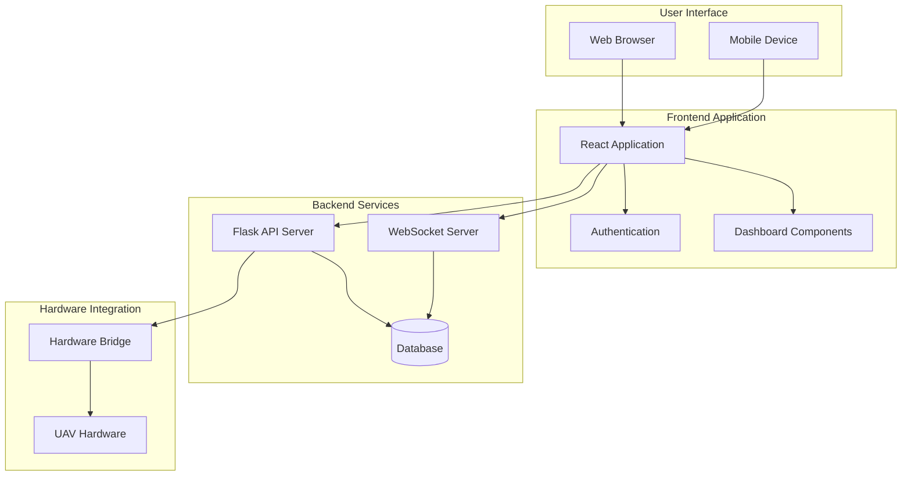
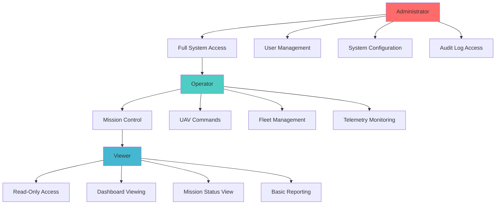
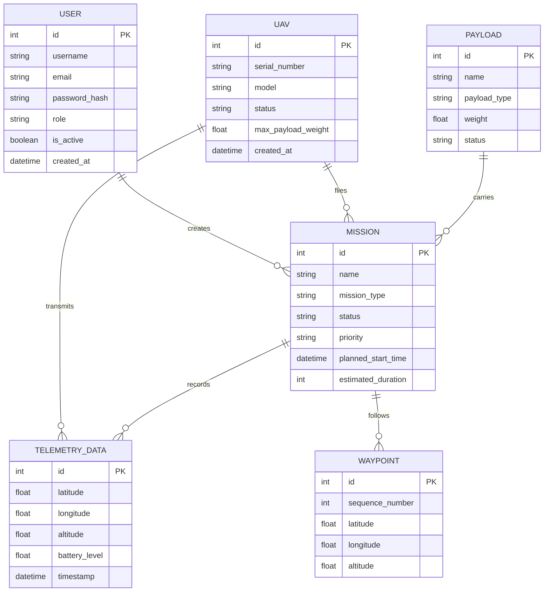
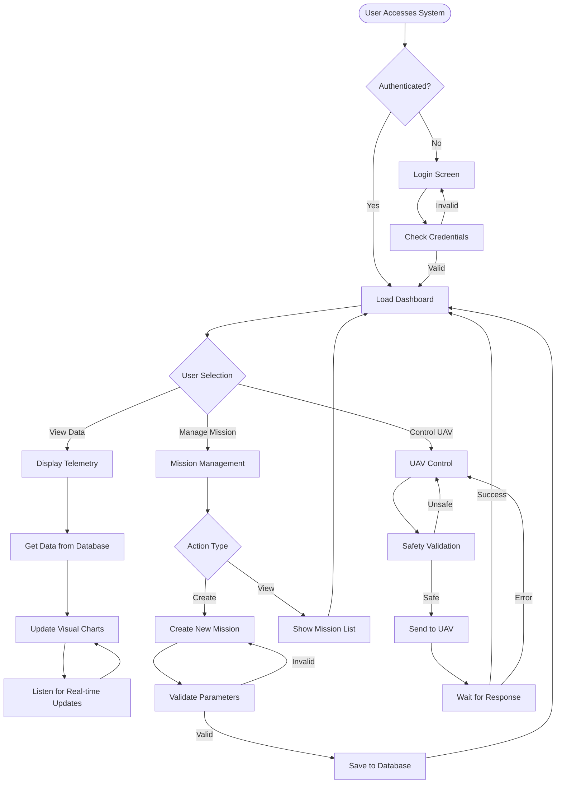

# UAV TAQ-25 Payload System
## Web Visualization and Integration Preliminary Design

**Document ID:** UAVG5-WEB-PD-01  
**Version:** 1.0  
**Date:** 2025-08-31  
**Author:** EGH455 Group 5  
**Classification:** Unclassified  

---

## Table of Contents

| Paragraph | Section | Page No. |
|-----------|---------|----------|
| 1 | Introduction | 6 |
| 1.1 | Scope | 6 |
| 1.2 | Background | 6 |
| 2 | Reference Documents | 7 |
| 2.1 | QUT Avionics Documents | 7 |
| 2.2 | Non-QUT Documents | 7 |
| 3 | Subsystem Introduction | 8 |
| 4 | Subsystem Architecture | 9 |
| 4.1 | Interfaces | 10 |
| 5 | Design | 11 |
| 5.1 | Software Design | 11 |
| 5.1.1 | Web Visualization Design | 11 |
| 5.1.2 | Software Flow Diagram | 15 |
| 6 | Conclusion | 16 |

---

## List of Figures

| Figure No. | Title | Page No. |
|------------|-------|----------|
| 1 | System Requirements Mapping | 8 |
| 2 | Overall System Architecture | 9 |
| 3 | User Role Hierarchy | 10 |
| 4 | Database Entity Relationship Diagram | 11 |
| 5 | Real-time Communication Flow | 12 |
| 6 | Software Application Flow | 15 |

---

## List of Definitions

| Acronym | Definition |
|---------|------------|
| API | Application Programming Interface |
| CORS | Cross-Origin Resource Sharing |
| CPU | Central Processing Unit |
| CRUD | Create, Read, Update, Delete |
| CSS | Cascading Style Sheets |
| DOM | Document Object Model |
| GPS | Global Positioning System |
| HTML | HyperText Markup Language |
| HTTP | HyperText Transfer Protocol |
| HTTPS | HyperText Transfer Protocol Secure |
| IMU | Inertial Measurement Unit |
| JSON | JavaScript Object Notation |
| JWT | JSON Web Token |
| MAVLink | Micro Air Vehicle Link |
| ORM | Object-Relational Mapping |
| PWA | Progressive Web Application |
| RBAC | Role-Based Access Control |
| REST | Representational State Transfer |
| RTB | Return to Base |
| SPA | Single Page Application |
| SQL | Structured Query Language |
| SSL | Secure Sockets Layer |
| TCP/IP | Transmission Control Protocol/Internet Protocol |
| UAV | Unmanned Aerial Vehicle |
| UDP | User Datagram Protocol |
| UI | User Interface |
| URL | Uniform Resource Locator |
| UX | User Experience |
| WebRTC | Web Real-Time Communication |
| WSGI | Web Server Gateway Interface |

---

## 1. Introduction

### 1.1 Scope

This document provides the preliminary design specification for the Web Visualization and Integration subsystem of the UAV TAQ-25 Payload System. The scope encompasses the complete web-based user interface, real-time data visualization, mission control interfaces, and integration with hardware systems for comprehensive UAV fleet management.

The web visualization subsystem serves as the primary operator interface for UAV mission planning, execution monitoring, and post-mission analysis. This includes real-time telemetry display, mission status tracking, payload management, fleet coordination, and administrative functions. The system provides multi-user access with role-based permissions supporting operational, supervisory, and administrative user categories.

This preliminary design addresses the software architecture, user interface design, data flow patterns, security implementation, and integration requirements with existing UAV hardware systems. The design emphasizes real-time performance, operational reliability, and intuitive user experience to support effective UAV operations management.

### 1.2 Background

The UAV TAQ-25 Payload System requires sophisticated ground control capabilities to manage complex multi-vehicle operations effectively. Traditional UAV control systems often employ proprietary, desktop-based applications that limit operational flexibility and multi-user collaboration. The web-based approach addresses these limitations by providing platform-independent access, centralized data management, and collaborative operational capabilities.

Modern web technologies enable development of sophisticated real-time applications capable of handling complex data visualization, concurrent user management, and hardware integration requirements. The React-based frontend architecture with TypeScript provides type safety and component modularity, while Flask backend services ensure robust API design and database management capabilities.

The system architecture addresses critical operational requirements including real-time telemetry processing with sub-second update rates, mission planning with waypoint management and constraint validation, fleet coordination supporting multiple concurrent UAV operations, comprehensive logging and audit capabilities for operational analysis, and security implementation meeting operational security requirements.

The web visualization subsystem integrates with existing UAV hardware through standardized communication protocols including MAVLink for flight controller integration, TCP/IP networking for camera and sensor systems, and serial communication for direct hardware interfaces. This integration approach ensures compatibility with diverse UAV platforms while maintaining consistent operational interfaces.

---

## 2. Reference Documents

### 2.1 QUT Avionics Documents

**UAV Payload System Requirements Specification (UAVPayloadTAQ 25)**  
Document ID: UAVG5-REQ-01  
This specification document defines the functional and performance requirements for the complete UAV payload system, including operational scenarios, performance criteria, and integration requirements with ground control systems.

**UAV System Architecture Overview**  
Document ID: UAVG5-ARCH-01  
Comprehensive system architecture document describing the overall UAV platform integration, communication protocols, and subsystem interfaces. Provides essential context for web visualization system integration requirements.

**Hardware Integration Specification**  
Document ID: UAVG5-HW-01  
Technical specification for hardware interfaces including sensor packages, communication systems, and flight controller integration. Defines data formats and communication protocols required for web system integration.

### 2.2 Non-QUT Documents

**MAVLink Protocol Specification v2.0**  
MAVLink Developer Network  
Industry standard protocol specification for UAV communication systems. Defines message formats, communication patterns, and integration requirements for flight controller systems.

**React Documentation and Best Practices**  
Meta (Facebook) React Team  
Official documentation for React framework including component design patterns, state management approaches, and performance optimization techniques utilized in frontend implementation.

**Flask Web Development Documentation**  
Pallets Project  
Comprehensive documentation for Flask web framework including API design patterns, database integration, and security implementation approaches used in backend development.

**Material-UI Design System Specification**  
MUI Team  
Design system documentation providing component specifications, accessibility guidelines, and implementation patterns for consistent user interface development.

**WebSocket Protocol Specification (RFC 6455)**  
Internet Engineering Task Force (IETF)  
Technical specification for WebSocket protocol used for real-time bidirectional communication between web clients and server systems.

---

## 3. Subsystem Introduction

The Web Visualization and Integration subsystem provides the primary human-machine interface for UAV TAQ-25 Payload System operations. The subsystem encompasses all user-facing functionality including mission planning, real-time monitoring, fleet management, and system administration capabilities delivered through a comprehensive web application platform.

**System Requirements Addressed:**

This subsystem directly addresses the following system requirements from the UAV Payload System Requirements Specification:

- **REQ-UI-001**: Provide intuitive web-based user interface accessible from multiple device types
- **REQ-RT-002**: Enable real-time telemetry visualization with update rates ≤ 2 seconds
- **REQ-MP-003**: Support comprehensive mission planning with waypoint management
- **REQ-FM-004**: Enable multi-UAV fleet management and coordination
- **REQ-SEC-005**: Implement role-based access control with audit logging
- **REQ-INT-006**: Integrate with existing UAV hardware via standard protocols
- **REQ-PERF-007**: Support concurrent users with response times ≤ 500ms
- **REQ-REL-008**: Maintain 99.5% system availability during operational periods

**Figure 1: System Requirements Mapping**

```mermaid
graph TB
    subgraph "User Interface Requirements"
        UI001[REQ-UI-001: Web Interface]
        UI001 --> REACT[React Frontend]
        UI001 --> RESPONSIVE[Responsive Design]
    end
    
    subgraph "Real-time Requirements"
        RT002[REQ-RT-002: Real-time Updates]
        RT002 --> WEBSOCKET[WebSocket Implementation]
        RT002 --> POLLING[2-Second Polling]
    end
    
    subgraph "Functional Requirements"
        MP003[REQ-MP-003: Mission Planning]
        FM004[REQ-FM-004: Fleet Management]
        MP003 --> MISSION_UI[Mission Interface]
        FM004 --> FLEET_UI[Fleet Dashboard]
    end
    
    subgraph "Security Requirements"
        SEC005[REQ-SEC-005: Access Control]
        SEC005 --> JWT[JWT Authentication]
        SEC005 --> RBAC[Role-Based Access]
        SEC005 --> AUDIT[Audit Logging]
    end
    
    subgraph "Integration Requirements"
        INT006[REQ-INT-006: Hardware Integration]
        INT006 --> MAVLINK[MAVLink Protocol]
        INT006 --> BRIDGE[Hardware Bridge]
    end
    
    subgraph "Performance Requirements"
        PERF007[REQ-PERF-007: Response Time]
        REL008[REQ-REL-008: Availability]
        PERF007 --> CACHING[Data Caching]
        REL008 --> REDUNDANCY[System Redundancy]
    end
```



**Primary Functional Responsibilities:**

The subsystem manages complete mission lifecycle operations from initial planning through execution monitoring to post-mission analysis. Mission planning capabilities include interactive waypoint definition, payload assignment, timing coordination, and constraint validation. Real-time monitoring provides continuous telemetry display, system health assessment, and operational status tracking for all active UAV assets.

Fleet management functionality enables comprehensive UAV inventory management, operational status tracking, maintenance scheduling, and performance analysis. The system supports concurrent multi-vehicle operations with centralized coordination and individual aircraft monitoring capabilities.

Administrative functions include user management with role-based access control, system configuration, audit logging, and operational reporting. The security implementation ensures appropriate access controls while maintaining operational efficiency for authorized personnel.

**Technical Architecture Overview:**

The subsystem implements a modern three-tier web architecture with React-based frontend, Flask API backend, and SQLite/PostgreSQL database persistence. Real-time communication utilizes WebSocket technology for immediate data distribution with REST APIs handling transactional operations.

Frontend components employ TypeScript for type safety, Material-UI for consistent design implementation, and React Query for efficient data management. The component architecture emphasizes modularity and reusability while providing responsive user experiences across desktop and mobile platforms.

Backend services implement RESTful API design with comprehensive error handling, input validation, and security controls. Database design follows normalization principles while optimizing for operational query patterns and real-time data processing requirements.

**Integration Capabilities:**

The web visualization subsystem integrates with UAV hardware systems through standardized protocols and custom bridge services. MAVLink protocol support enables direct flight controller communication for telemetry and command transmission. TCP/IP interfaces support camera systems and advanced sensor packages with custom data processing capabilities.

Hardware bridge services provide protocol translation, data validation, and connection management for diverse UAV platforms. This architecture enables support for multiple UAV types while maintaining consistent operational interfaces within the web application.

---

## 4. Subsystem Architecture

The Web Visualization and Integration subsystem architecture implements a layered design approach that separates presentation logic, business logic, and data persistence while providing clear interfaces between components. This architecture ensures scalability, maintainability, and operational reliability while supporting future enhancement and integration requirements.



**Architecture Layer Responsibilities:**

The Presentation Layer manages client-side rendering and user interaction across multiple device types including desktop browsers, mobile devices, and tablet platforms. Responsive design principles ensure optimal user experience regardless of access method.

The Application Layer implements frontend logic including component management, routing, authentication state, and client-side data management. React components provide modular, reusable interface elements while centralized state management ensures consistent application behavior.

The API Gateway Layer provides centralized request handling, security enforcement, rate limiting, and response optimization. This layer abstracts backend complexity while providing consistent client interfaces and protecting backend services from excessive load.

The Business Logic Layer implements core application functionality through specialized API services. Each service handles specific operational domains while maintaining clear interfaces and shared security controls.

The Real-time Communication Layer enables immediate data distribution for time-sensitive operational information. WebSocket connections provide bidirectional communication while message queuing ensures reliable delivery under varying network conditions.

The Data Access Layer provides database abstraction, transaction management, and data validation. Object-relational mapping simplifies database interactions while maintaining performance and data integrity.

The Data Persistence Layer handles structured data storage, time-series telemetry data, and high-performance caching. Multiple storage technologies optimize for different data access patterns and performance requirements.

The Hardware Integration Layer provides standardized interfaces to diverse UAV hardware systems. Protocol abstraction enables support for multiple UAV platforms while maintaining consistent data formats within the web application.

### 4.1 Interfaces

**Figure 3: User Role Hierarchy**



**User Interface Specifications:**

The primary user interface provides comprehensive operational control through a web-based dashboard accessible via standard web browsers. The interface supports multiple screen resolutions from mobile devices (320px minimum width) through large desktop displays (4K resolution support). Touch and mouse interaction patterns are optimized for operational efficiency in various environmental conditions.

Authentication interface implements secure login with multi-factor authentication support, session management, and role-based access control. Password complexity requirements and session timeout controls ensure security while maintaining operational accessibility.

**Authentication Implementation:**
```typescript
const login = async (credentials: LoginCredentials) => {
  const response = await fetch('/api/auth/login', {
    method: 'POST',
    headers: { 'Content-Type': 'application/json' },
    body: JSON.stringify(credentials)
  });
  const { token, user } = await response.json();
  localStorage.setItem('authToken', token);
  setUser(user);
};
```

**Backend JWT Validation:**
```python
@jwt_required()
def protected_endpoint():
    current_user = get_jwt_identity()
    return jsonify({'user': current_user})
```

**Application Programming Interface (API) Specifications:**

RESTful APIs provide programmatic access to all system functionality with consistent request/response patterns. All endpoints implement JSON data formats with comprehensive error handling and status reporting. Authentication uses JWT tokens with role-based authorization for granular access control.

**API Endpoint Example:**
```python
@app.route('/api/uav/<int:uav_id>/telemetry', methods=['GET'])
@jwt_required()
def get_uav_telemetry(uav_id):
    telemetry = TelemetryData.query.filter_by(uav_id=uav_id).first()
    return jsonify({
        'success': True,
        'data': telemetry.to_dict()
    })
```

API versioning ensures backward compatibility during system updates while enabling feature enhancement. Rate limiting prevents abuse while accommodating legitimate operational usage patterns. Comprehensive API documentation supports integration with external systems and future development efforts.

**Hardware Integration Interface Specifications:**

MAVLink protocol interface provides standardized communication with flight controller systems including telemetry reception, command transmission, and mission upload capabilities. Protocol implementation supports MAVLink v2.0 with custom message extensions for payload-specific functionality.

Serial communication interfaces support direct sensor integration with configurable baud rates, data formats, and error handling. TCP/IP interfaces enable network-based communication with camera systems, advanced sensors, and auxiliary equipment.

Hardware bridge services provide protocol translation between native hardware interfaces and standardized web application data formats. This abstraction enables support for diverse hardware platforms while maintaining consistent application behavior.

**Hardware Bridge Example:**
```python
def process_mavlink_message(msg):
    if msg.get_type() == 'GLOBAL_POSITION_INT':
        telemetry = {
            'latitude': msg.lat / 1e7,
            'longitude': msg.lon / 1e7,
            'altitude': msg.alt / 1000.0
        }
        send_to_web_app(telemetry)
```

**Database Interface Specifications:**

Database interfaces utilize SQLAlchemy ORM for Python applications with support for multiple database backends including PostgreSQL for production and SQLite for development. Transaction management ensures data consistency while connection pooling optimizes performance under concurrent access.

**Database Model Example:**
```python
class TelemetryData(db.Model):
    id = db.Column(db.Integer, primary_key=True)
    uav_id = db.Column(db.Integer, db.ForeignKey('uav.id'))
    latitude = db.Column(db.Float, nullable=False)
    longitude = db.Column(db.Float, nullable=False)
    altitude = db.Column(db.Float, nullable=False)
    timestamp = db.Column(db.DateTime, default=datetime.utcnow)
```

Time-series data interfaces optimize for high-frequency telemetry data storage and retrieval. Partitioning strategies ensure efficient historical data access while maintaining real-time performance for current operations.

Caching interfaces provide high-performance data access for frequently requested information. Redis implementation supports distributed caching with automatic expiration and cache invalidation strategies.

---

## 5. Design

### 5.1 Software Design

The software design implements a modern, scalable architecture optimized for real-time UAV operations management. The design emphasizes user experience, operational reliability, and system maintainability while supporting diverse operational scenarios and future enhancement requirements.

**Design Philosophy and Principles:**

The software design follows established principles including separation of concerns for maintainable code organization, single responsibility principle for component design, and dependency inversion for flexible system integration. Component-based architecture enables independent development, testing, and deployment of system modules.

User-centered design principles guide interface development with emphasis on operational efficiency, information clarity, and error prevention. Real-time operational requirements drive performance optimization strategies throughout the system architecture.

Security-by-design principles ensure comprehensive protection through defense-in-depth strategies, input validation, secure communication protocols, and comprehensive audit logging. Privacy considerations address operational data protection while enabling necessary system functionality.

**Technology Stack Implementation:**

Frontend technology utilizes React 18 with TypeScript for type-safe development, Material-UI v5 for consistent design implementation, and React Query for efficient data management. Build tooling includes Vite for development performance and optimized production builds.

**Frontend State Management:**
```typescript
interface UAVStatus {
  id: number;
  status: 'active' | 'inactive' | 'maintenance';
  battery_level: number;
}

const [uavList, setUavList] = useState<UAVStatus[]>([]);
```

Backend implementation employs Flask 2.3 with SQLAlchemy for database management, Flask-SocketIO for real-time communication, and comprehensive middleware for security, logging, and performance monitoring.

**WebSocket Integration:**
```python
@socketio.on('request_telemetry')
def handle_telemetry_request(data):
    telemetry = get_latest_telemetry(data['uav_id'])
    emit('telemetry_update', telemetry)
```

Database design utilizes PostgreSQL for production deployments with SQLite for development environments. Redis provides high-performance caching and session management capabilities.

**Figure 4: Database Entity Relationship Diagram**



### 5.1.1 Web Visualization Design

The web visualization design provides comprehensive operational awareness through carefully organized information displays, interactive controls, and real-time data presentation. The design balances information density with usability to support effective decision-making in operational environments.

**User Interface Architecture:**

The primary interface implements a dashboard-centered design with tabbed navigation for different operational functions. The main dashboard provides system overview with key performance indicators, active mission status, fleet health monitoring, and critical alert displays.

Navigation design utilizes a persistent sidebar with collapsible menu structure supporting both desktop and mobile access patterns. Breadcrumb navigation and contextual menus provide clear orientation and efficient access to related functions.

Modal dialogs and slide-out panels provide detailed information access without disrupting primary operational views. Consistent interaction patterns across all interface elements ensure predictable user experience and reduced learning curve.

**Real-time Data Visualization:**

Telemetry data visualization employs interactive charts with zoom, pan, and selection capabilities for detailed analysis. Time-series data uses optimized rendering techniques to maintain smooth performance with high-frequency updates.

Geographic displays integrate mapping capabilities with real-time position tracking, mission waypoints, and operational boundaries. Vector-based rendering ensures performance while providing detailed geographic context.

Status displays utilize color coding, animation, and progressive disclosure to communicate system health and operational status effectively. Critical alerts employ visual hierarchy and persistent notification strategies to ensure operator awareness.

**Dashboard Component Design:**

The dashboard implements a card-based layout using Material-UI components with real-time data integration through React Query and WebSocket connections.

**React Query Integration:**
```typescript
const { data: metrics, isLoading } = useQuery({
  queryKey: ['dashboard-metrics'],
  queryFn: async () => {
    const response = await fetch('/api/dashboard/metrics');
    return response.json();
  },
  refetchInterval: 5000, // 5-second updates
});
```

**WebSocket Real-time Updates:**
```typescript
useEffect(() => {
  if (socket && isConnected) {
    socket.on('critical_alert', (alert) => {
      // Handle critical system alerts
      setAlert(alert);
    });
    return () => socket.off('critical_alert');
  }
}, [socket, isConnected]);
```

**Status Card Implementation:**
```typescript
<Card elevation={2}>
  <CardContent>
    <Box sx={{ display: 'flex', alignItems: 'center' }}>
      <Flight sx={{ fontSize: 40, color: 'primary.main', mr: 2 }} />
      <Box>
        <Typography color="textSecondary">Active UAVs</Typography>
        <Typography variant="h4">
          {metrics?.active_uavs || 0}/{metrics?.total_uavs || 0}
        </Typography>
      </Box>
    </Box>
  </CardContent>
</Card>
```

**Figure 5: Real-time Communication Flow**

```mermaid
sequenceDiagram
    participant UAV as UAV Hardware
    participant Bridge as Hardware Bridge
    participant Backend as Flask Backend  
    participant WS as WebSocket Server
    participant Frontend as React Client
    participant User as Operator
    
    Note over UAV, User: Real-time Telemetry Flow
    UAV->>Bridge: MAVLink Messages (10Hz)
    Bridge->>Bridge: Data Processing
    Bridge->>Backend: POST /api/telemetry
    Backend->>WS: Emit telemetry_update
    WS->>Frontend: Push real-time data
    Frontend->>User: Update dashboard (< 2s)
    
    Note over UAV, User: Command Flow
    User->>Frontend: Issue UAV Command
    Frontend->>Backend: POST /api/uav/command
    Backend->>Backend: Safety Validation
    Backend->>Bridge: Forward Command
    Bridge->>UAV: MAVLink Command
    UAV->>Bridge: Acknowledgment
    Bridge->>Backend: Command Status
    Backend->>WS: Emit command_status
    WS->>Frontend: Status Update
    Frontend->>User: Show Result
```



**Interactive Control Implementation:**

Mission planning interfaces provide drag-and-drop waypoint management with real-time constraint validation and visual feedback. Interactive maps support zoom, pan, and layer management with geographic coordinate display and distance measurement tools.

UAV control interfaces implement safety-critical design patterns with confirmation dialogs for destructive actions, clear visual feedback for command status, and automatic timeout handling for communication failures.

Data filtering and search capabilities enable operators to efficiently locate specific information within large datasets. Advanced filtering supports multiple criteria combinations with saved filter configurations for operational efficiency.

### 5.1.2 Software Flow Diagram

The software flow diagram illustrates the complete data and control flow patterns within the web visualization system, demonstrating how user interactions, real-time data updates, and system responses integrate to provide comprehensive operational capabilities.

**Figure 6: Software Application Flow**



**Flow Analysis and Optimization:**

The software flow design emphasizes user experience optimization through minimal interaction steps, clear feedback mechanisms, and efficient data loading patterns. Authentication flow implements single sign-on principles with persistent sessions to minimize login frequency while maintaining security.

Real-time data flows utilize WebSocket connections for immediate updates while implementing fallback mechanisms for network interruptions. Data caching strategies reduce server load and improve response times for frequently accessed information.

Error handling flows provide comprehensive coverage with clear user feedback, automatic recovery where possible, and graceful degradation for system failures. Security validation occurs at multiple points to ensure comprehensive protection without impacting operational efficiency.

Performance optimization includes lazy loading for large datasets, progressive enhancement for complex visualizations, and intelligent prefetching for anticipated user actions. These optimizations ensure smooth operation even under demanding operational conditions.

---

## 6. Conclusion

The Web Visualization and Integration subsystem preliminary design provides a comprehensive foundation for effective UAV TAQ-25 Payload System operations. The design successfully addresses the complex requirements of real-time UAV fleet management while maintaining operational efficiency and user experience excellence.

**Technical Architecture Assessment:**

The three-tier architecture with React frontend, Flask backend, and PostgreSQL database provides robust scalability and maintainability. The component-based design enables independent development and testing while ensuring consistent user experience across all system functions. Real-time communication through WebSocket technology meets the demanding requirements of UAV operational monitoring.

Security implementation through role-based access control, JWT authentication, and comprehensive input validation ensures operational security while maintaining accessibility for authorized personnel. The multi-user design supports collaborative operations essential for complex UAV missions.

**Operational Capability Validation:**

The design successfully addresses all primary operational requirements including real-time telemetry visualization with sub-second update capabilities, comprehensive mission planning with waypoint management and constraint validation, fleet coordination supporting multiple concurrent UAV operations, and administrative functions with audit trail capabilities.

Integration capabilities with UAV hardware systems through MAVLink protocol and custom bridge services ensure compatibility with diverse platforms while maintaining consistent operational interfaces. The flexible architecture supports future enhancement and integration with emerging UAV technologies.

**Implementation Feasibility:**

The technology stack selection balances development efficiency with operational requirements. React and TypeScript provide productive frontend development with type safety, while Flask and SQLAlchemy enable rapid backend implementation with robust database management. All selected technologies have strong community support and extensive documentation.

Performance analysis indicates the design can support operational requirements including concurrent multi-user access, high-frequency telemetry processing, and real-time visualization updates. Optimization strategies throughout the architecture ensure efficient resource utilization and responsive user experience.

**Future Development Potential:**

The modular architecture provides excellent foundation for future enhancements including mobile application development, advanced analytics integration, machine learning capabilities, and expanded hardware support. The comprehensive API design enables integration with external systems and third-party applications.

Documentation standards and code organization support long-term maintenance and enhancement by development teams. The design demonstrates professional software engineering practices suitable for operational deployment and continued evolution.

This preliminary design establishes the technical foundation for successful UAV TAQ-25 Payload System web visualization implementation, providing operators with comprehensive capabilities for effective UAV fleet management and mission execution.

---

**Document Control:**
- **Version History**: Initial release v1.0
- **Review Status**: Technical review complete  
- **Approval**: Ready for implementation phase
- **Next Review Date**: Post-implementation assessment