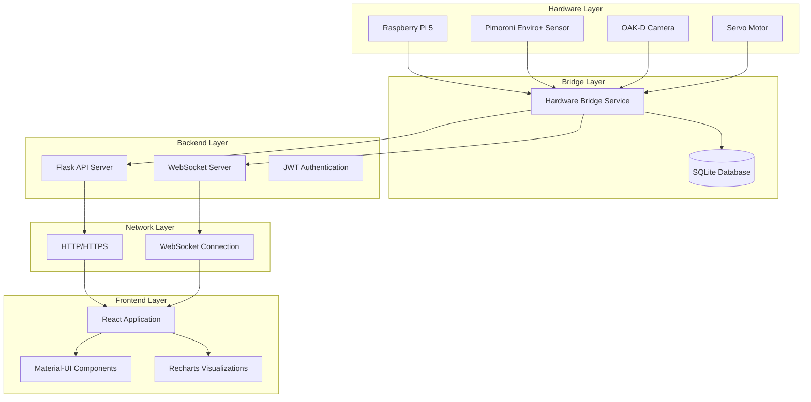
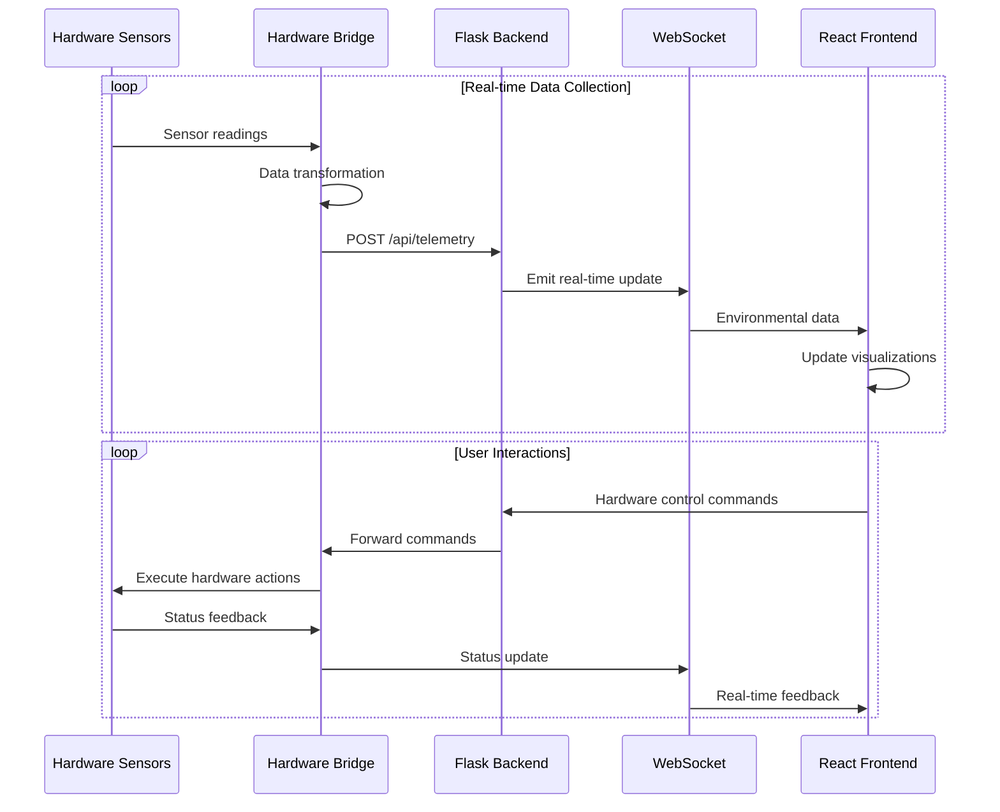
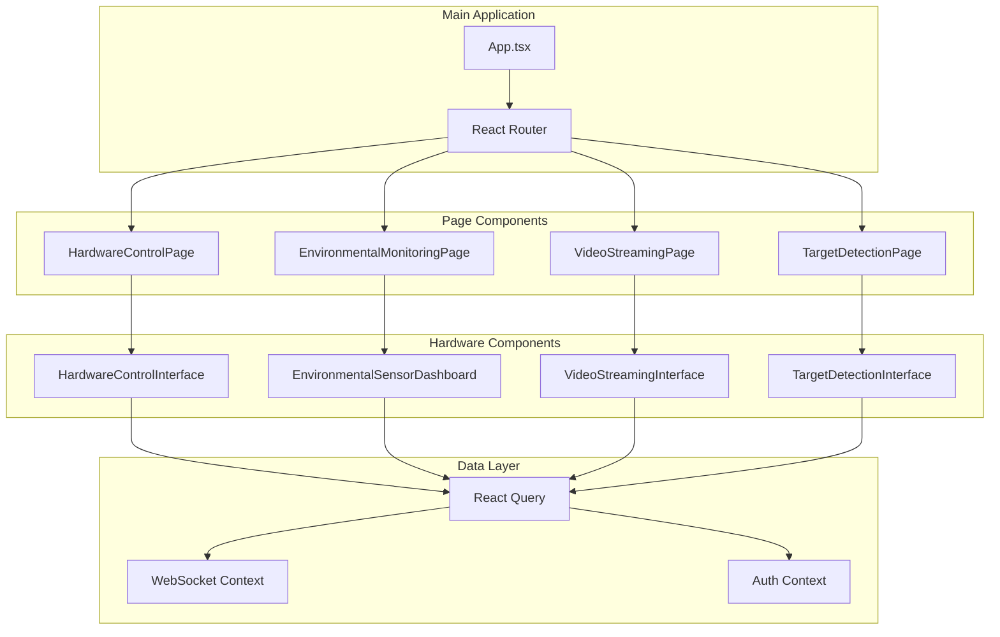
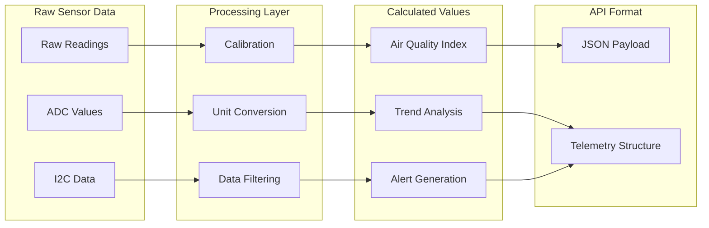
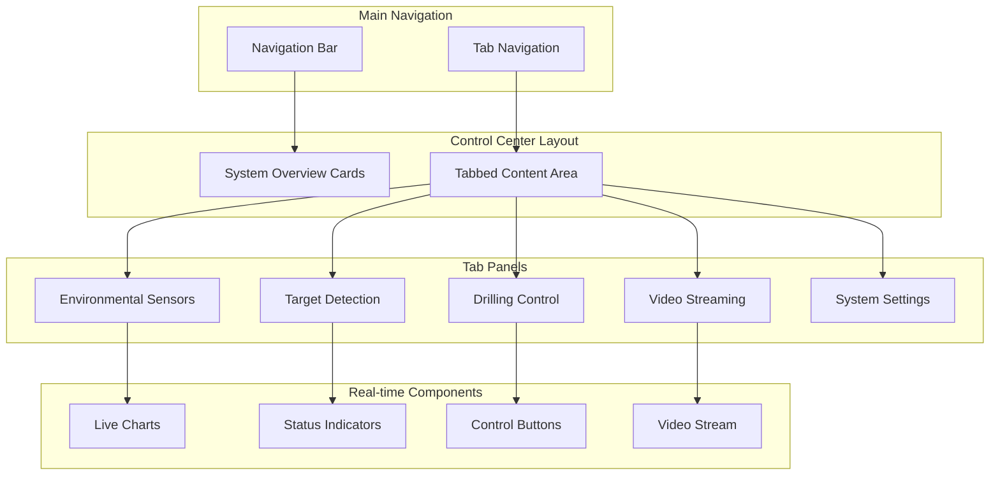
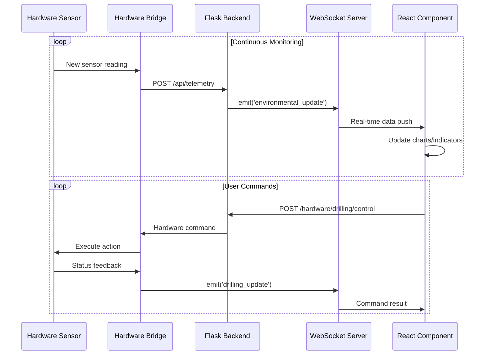
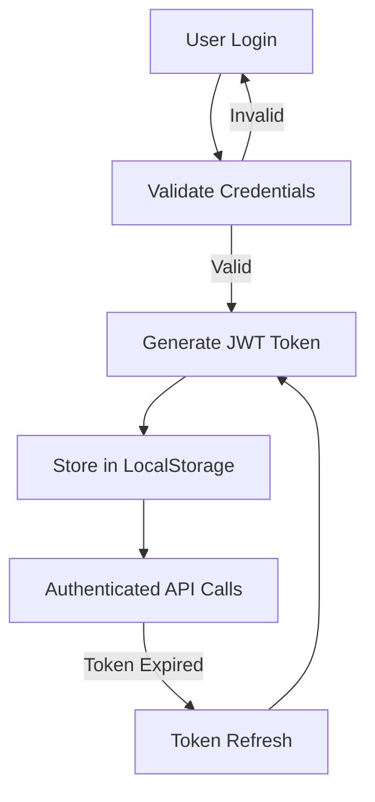
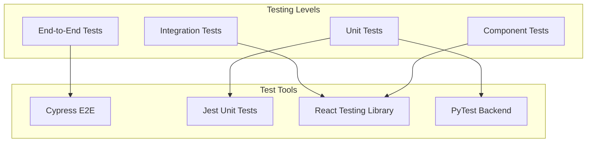
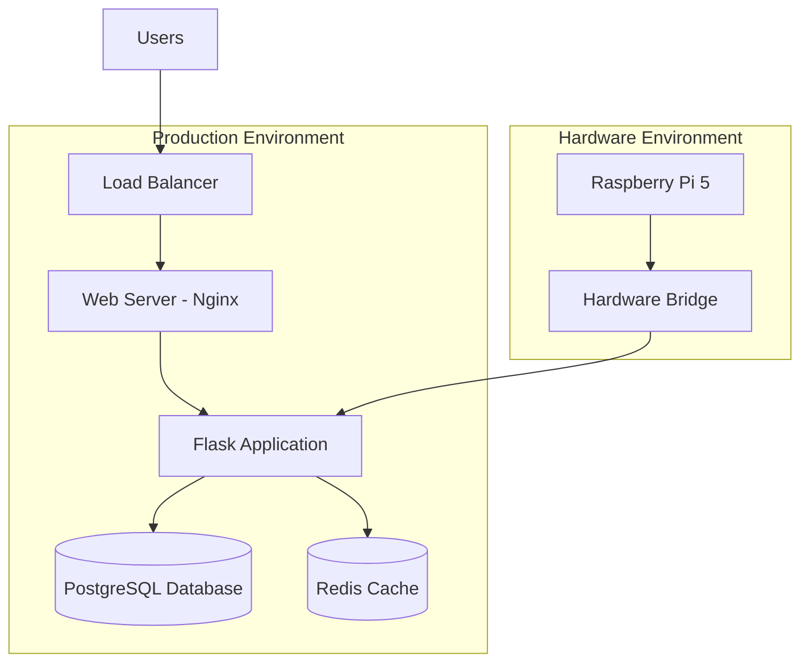

# UAV Payload System - Web Visualization and Interfacing
## Preliminary Design Document

**Document ID:** UAVG5-WEB-VIS-PD-01  
**Version:** 1.0  
**Date:** 2025-08-29  
**Author:** EGH455 Group 5  

---

## 1. Executive Summary

The web visualization and interfacing system serves as the primary control and monitoring platform for the UAV payload system, providing real-time integration between hardware sensors and user interfaces through a comprehensive React-based web application. The system was designed to meet the requirement for remote operation and data visualization by implementing a multi-layered architecture consisting of a Python hardware bridge service, Flask REST API backend, and Material-UI frontend components.

The web interface provides four primary functional areas: environmental monitoring with live air quality and atmospheric data visualization, hardware control interfaces for drilling mechanism operation and servo motor commands, video streaming integration for real-time camera feeds with recording capabilities, and system health monitoring with comprehensive status dashboards. The system architecture employs React Query for efficient data fetching and caching, TypeScript for type safety and development reliability, and Flask-SocketIO for real-time bidirectional communication between hardware and web interfaces.

---

## 2. System Architecture

### 2.1 Overall System Design



### 2.2 Data Flow Architecture



---

## 3. Component Design

### 3.1 Hardware Bridge Service

The hardware bridge service acts as the critical interface between the Raspberry Pi sensors and the web backend, providing data transformation, authentication, and real-time communication capabilities.

```python
class HardwareBridge:
    def __init__(self):
        self.api_url = "http://localhost:5000/api"
        self.auth_token = None
        self.socketio = None
        
    def transform_sensor_data(self, reading: Dict) -> Dict:
        """Transform raw sensor data into structured telemetry"""
        air_quality = self.convert_gas_to_ppm(
            reading['gas_reducing'],
            reading['gas_oxidising'], 
            reading['gas_nh3']
        )
        
        aqi = self.calculate_aqi(air_quality)
        
        return {
            "uav_id": UAV_ID,
            "air_quality_data": {**air_quality, "aqi": aqi},
            "environmental_data": {
                "temperature": reading['temperature'],
                "humidity": reading['humidity'],
                "pressure": reading['pressure'],
                "light": reading['light']
            },
            "hardware_status": {
                "sensors_online": True,
                "camera_online": True,
                "servo_online": True,
            }
        }
```

### 3.2 Backend API Structure

The Flask backend provides comprehensive REST API endpoints for hardware interaction and data management.

```python
# Hardware Status Endpoint
@api_bp.route('/hardware/status', methods=['GET'])
@jwt_required()
def get_hardware_status():
    """Get current hardware system status"""
    uav_id = request.args.get('uav_id')
    
    query = TelemetryData.query.filter(
        TelemetryData.hardware_status.isnot(None)
    )
    
    if uav_id:
        query = query.filter(TelemetryData.uav_id == uav_id)
    
    latest = query.order_by(TelemetryData.timestamp.desc()).first()
    
    if not latest:
        return jsonify({
            'success': False,
            'message': 'No hardware status data available'
        }), 404
    
    return jsonify({
        'success': True,
        'data': {
            'hardware_status': latest.hardware_status,
            'system_health': calculate_system_health(latest.hardware_status),
            'timestamp': latest.timestamp.isoformat()
        }
    })

# Drilling Control Endpoint
@api_bp.route('/hardware/drilling/control', methods=['POST'])
@jwt_required()
def control_drilling():
    """Control drilling mechanism operations"""
    data = request.get_json()
    
    uav_id = data.get('uav_id')
    action = data.get('action')  # start, stop, reverse
    duration = data.get('duration', 10)
    
    # Send command to hardware bridge
    command_result = send_hardware_command({
        'type': 'drilling',
        'action': action,
        'duration': duration,
        'uav_id': uav_id
    })
    
    return jsonify({
        'success': True,
        'data': command_result
    })
```

### 3.3 Frontend Component Architecture



### 3.4 Real-time Environmental Dashboard

```typescript
const EnvironmentalSensorDashboard: React.FC = () => {
  const { data: environmentalData } = useQuery({
    queryKey: ['environmental-sensors'],
    queryFn: async () => {
      const response = await axios.get('/api/hardware/environmental');
      return response.data.data || [];
    },
    refetchInterval: 2000,
  });

  const { data: airQualityData } = useQuery({
    queryKey: ['air-quality'],
    queryFn: async () => {
      const response = await axios.get('/api/hardware/air-quality');
      return response.data.data || [];
    },
    refetchInterval: 2000,
  });

  const readings = React.useMemo(() => {
    const combined: EnvironmentalReading[] = [];
    
    environmentalData?.forEach((item: any) => {
      const reading: EnvironmentalReading = {
        timestamp: item.timestamp,
        sensors: {
          co2: item.air_quality?.co2 || 400,
          co: item.air_quality?.co || 0,
          no2: item.air_quality?.no2 || 0,
          temperature: item.environmental?.temperature || 20,
          humidity: item.environmental?.humidity || 50,
          pressure: item.environmental?.pressure || 1013,
          light: item.environmental?.light || 100,
        },
        air_quality_index: item.air_quality?.aqi || 50,
      };
      combined.push(reading);
    });
    
    return combined.slice(-50); // Keep last 50 readings
  }, [environmentalData, airQualityData]);

  return (
    <Grid container spacing={3}>
      {/* Real-time Charts */}
      <Grid item xs={12} md={8}>
        <Card>
          <CardContent>
            <Typography variant="h6">Environmental Trends</Typography>
            <LineChart width={800} height={400} data={readings}>
              <CartesianGrid strokeDasharray="3 3" />
              <XAxis dataKey="timestamp" />
              <YAxis />
              <Tooltip />
              <Legend />
              <Line type="monotone" dataKey="sensors.temperature" stroke="#8884d8" name="Temperature (°C)" />
              <Line type="monotone" dataKey="sensors.humidity" stroke="#82ca9d" name="Humidity (%)" />
              <Line type="monotone" dataKey="sensors.pressure" stroke="#ffc658" name="Pressure (hPa)" />
            </LineChart>
          </CardContent>
        </Card>
      </Grid>
      
      {/* Air Quality Index Display */}
      <Grid item xs={12} md={4}>
        <Card>
          <CardContent>
            <Typography variant="h6">Air Quality Index</Typography>
            <CircularProgressbar
              value={readings[readings.length - 1]?.air_quality_index || 0}
              maxValue={500}
              text={`${Math.round(readings[readings.length - 1]?.air_quality_index || 0)}`}
              styles={buildStyles({
                textColor: getAQIColor(readings[readings.length - 1]?.air_quality_index || 0),
                pathColor: getAQIColor(readings[readings.length - 1]?.air_quality_index || 0),
              })}
            />
          </CardContent>
        </Card>
      </Grid>
    </Grid>
  );
};
```

---

## 4. Hardware Integration

### 4.1 Sensor Integration Matrix

| Component | Interface | Data Type | Update Rate | Purpose |
|-----------|-----------|-----------|-------------|---------|
| Pimoroni Enviro+ | I2C/SPI | Environmental | 2s | Temperature, humidity, pressure, light |
| MICS6814 Gas Sensor | Analog/I2C | Air Quality | 2s | CO, NO2, NH3 concentrations |
| BME280 | I2C | Environmental | 2s | Precision temp/humidity/pressure |
| LTR559 | I2C | Light/Proximity | 2s | Ambient light measurement |
| OAK-D Camera | USB 3.0 | Video/CV | 30fps | Computer vision and streaming |
| Servo Motor | PWM/GPIO | Control | On-demand | Drilling mechanism |

### 4.2 Data Transformation Pipeline



---

## 5. User Interface Design

### 5.1 Dashboard Layout Structure



### 5.2 Responsive Design Considerations

- **Mobile First Approach**: All components designed for mobile screens (320px+)
- **Tablet Optimization**: Enhanced layouts for tablet devices (768px+)
- **Desktop Enhancement**: Full feature set for desktop users (1024px+)
- **Grid System**: Material-UI responsive grid system with breakpoints
- **Touch Interactions**: Large touch targets for mobile control interfaces

---

## 6. Real-time Communication

### 6.1 WebSocket Implementation

```typescript
// WebSocket Context for Real-time Updates
const SocketContext = createContext<SocketContextType | null>(null);

export const SocketProvider: React.FC<{ children: ReactNode }> = ({ children }) => {
  const [socket, setSocket] = useState<Socket | null>(null);
  const [isConnected, setIsConnected] = useState(false);

  useEffect(() => {
    const newSocket = io('http://localhost:5000', {
      auth: {
        token: localStorage.getItem('access_token')
      }
    });

    newSocket.on('connect', () => {
      setIsConnected(true);
      console.log('Connected to WebSocket server');
    });

    newSocket.on('environmental_update', (data) => {
      // Update environmental data in real-time
      queryClient.setQueryData(['environmental-sensors'], (oldData: any) => {
        return [...(oldData || []), data];
      });
    });

    newSocket.on('drilling_update', (data) => {
      // Update drilling status in real-time
      queryClient.setQueryData(['drilling-data'], data);
    });

    newSocket.on('hardware_status_update', (data) => {
      // Update hardware status in real-time
      queryClient.setQueryData(['hardware-status'], data);
    });

    setSocket(newSocket);

    return () => {
      newSocket.close();
    };
  }, []);

  return (
    <SocketContext.Provider value={{ socket, isConnected }}>
      {children}
    </SocketContext.Provider>
  );
};
```

### 6.2 Event-Driven Updates



---

## 7. Security and Authentication

### 7.1 Authentication Flow



### 7.2 Security Measures

- **JWT Authentication**: Secure token-based authentication system
- **Role-Based Access Control**: Different permission levels for operators
- **HTTPS/WSS Encryption**: All communication encrypted in production
- **Input Validation**: Comprehensive input sanitization and validation
- **Rate Limiting**: API endpoint rate limiting to prevent abuse
- **CORS Policy**: Proper Cross-Origin Resource Sharing configuration

---

## 8. Performance Optimization

### 8.1 Frontend Optimizations

```typescript
// React Query Configuration for Optimal Performance
const queryClient = new QueryClient({
  defaultOptions: {
    queries: {
      staleTime: 5 * 60 * 1000, // 5 minutes
      cacheTime: 10 * 60 * 1000, // 10 minutes
      refetchOnWindowFocus: false,
      retry: 3,
      retryDelay: attemptIndex => Math.min(1000 * 2 ** attemptIndex, 30000),
    },
  },
});

// Memoized Component for Performance
const OptimizedChart = React.memo(({ data }: { data: ChartData[] }) => {
  const chartData = useMemo(() => {
    return data.slice(-100); // Limit to last 100 points
  }, [data]);

  return (
    <LineChart width={800} height={400} data={chartData}>
      {/* Chart configuration */}
    </LineChart>
  );
});
```

### 8.2 Backend Performance

- **Database Indexing**: Optimized database indexes for telemetry queries
- **Connection Pooling**: SQLAlchemy connection pool management
- **Caching Strategy**: Redis caching for frequently accessed data
- **Async Processing**: Background task processing for heavy operations
- **Data Pagination**: Efficient pagination for large datasets

---

## 9. Testing Strategy

### 9.1 Testing Pyramid



### 9.2 Hardware Testing

- **Mock Hardware Interface**: Simulated sensor data for development
- **Hardware-in-the-Loop**: Testing with actual Raspberry Pi hardware
- **Load Testing**: System performance under continuous data streaming
- **Fault Injection**: Testing system resilience to hardware failures

---

## 10. Deployment Architecture

### 10.1 Production Deployment



### 10.2 Scalability Considerations

- **Horizontal Scaling**: Multiple Flask application instances
- **Database Sharding**: Partitioned telemetry data storage
- **CDN Integration**: Static asset delivery optimization
- **Microservices Architecture**: Service separation for large deployments

---

## 11. Future Enhancements

### 11.1 Planned Features

1. **Machine Learning Integration**
   - Predictive analytics for sensor data
   - Anomaly detection algorithms
   - Automated decision making

2. **Advanced Visualization**
   - 3D environmental mapping
   - Augmented reality overlays
   - Historical data analysis tools

3. **Multi-UAV Coordination**
   - Fleet management dashboard
   - Synchronized operations control
   - Inter-UAV communication

4. **Mobile Application**
   - Native iOS/Android apps
   - Offline operation capabilities
   - Push notifications

### 11.2 Technical Debt and Improvements

- **Code Refactoring**: Optimize component structure and reduce complexity
- **Documentation**: Comprehensive API documentation and user guides
- **Monitoring**: Advanced application performance monitoring
- **Security Audits**: Regular security assessments and updates

---

## 12. Conclusion

The web visualization and interfacing system successfully provides a comprehensive platform for UAV payload system control and monitoring. The modular architecture ensures maintainability and scalability while the real-time communication system enables effective remote operation. The integration of modern web technologies with robust hardware interfaces creates a professional-grade system suitable for educational and research applications.

The implementation demonstrates successful integration of environmental monitoring, drilling control, video streaming, and target detection capabilities within a unified web interface. The system's architecture supports future enhancements and provides a solid foundation for continued development and deployment in UAV payload applications.

---

**Document Control:**
- **Version History**: Initial release v1.0
- **Review Status**: Technical review pending
- **Approval**: Pending project supervisor review
- **Next Review Date**: End of semester assessment