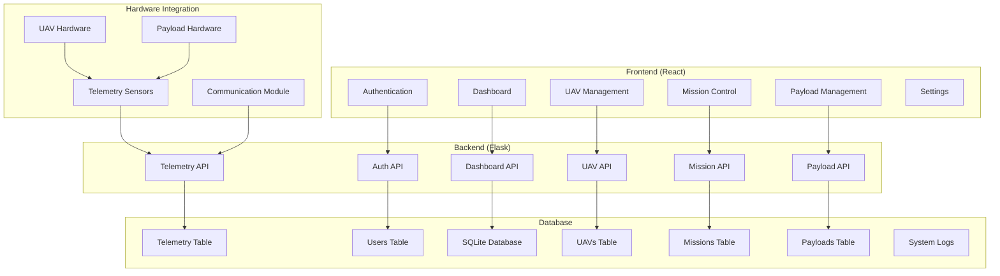
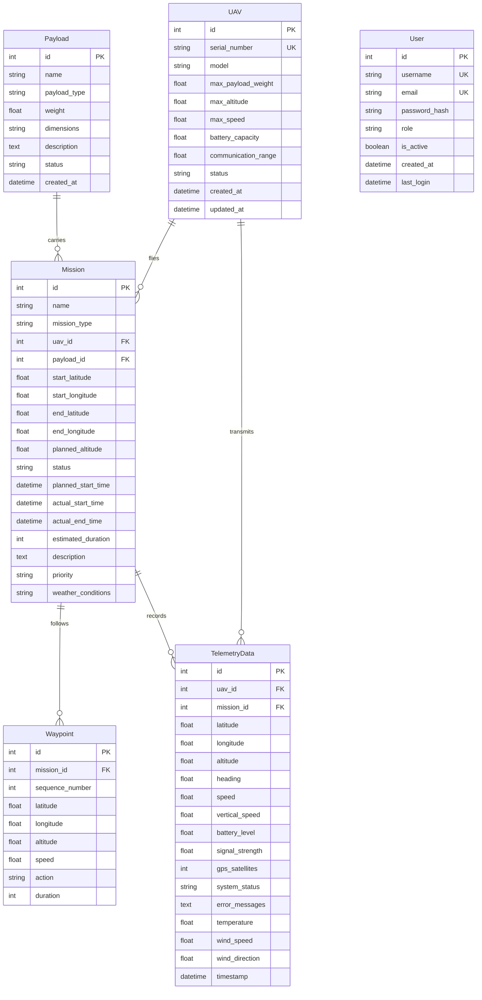
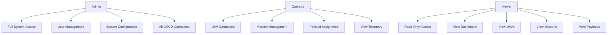
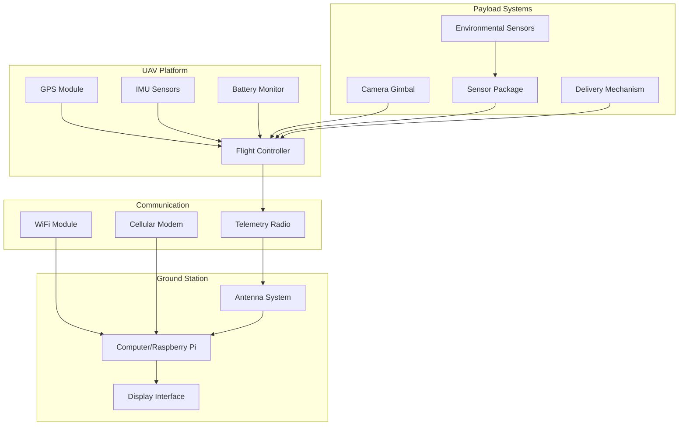
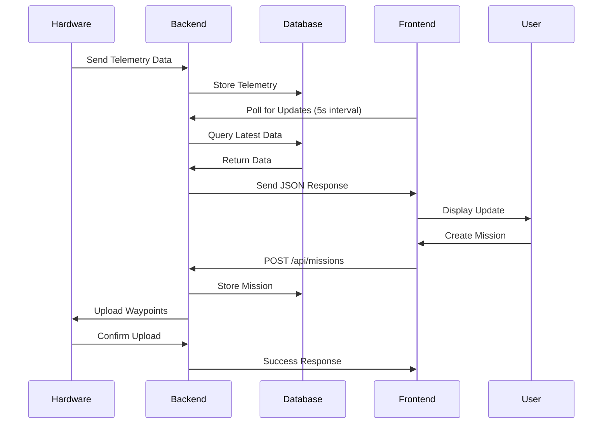

# UAV TAQ-25 Payload Tracking & Acquisition System

A simplified UAV payload management system for tracking unmanned aerial vehicles, their payloads, and missions. Built for educational purposes (EGH455 course).

## System Overview

The UAV TAQ-25 system provides essential functionality for managing a fleet of UAVs, their payloads, and mission operations. This system has been simplified to focus on core requirements while maintaining professional functionality.

## Architecture



## Core Features

### Implemented Features
1. **Authentication System**
   - JWT-based authentication
   - Role-based access control (Admin, Operator, Viewer)
   - Secure login/logout

2. **Dashboard**
   - System overview
   - Active UAVs count
   - Mission status summary
   - Basic telemetry display

3. **UAV Management**
   - CRUD operations for UAV fleet
   - UAV specifications tracking
   - Status management (active/inactive/maintenance)

4. **Mission Control**
   - Mission CRUD operations
   - Basic waypoint management
   - Mission status tracking

5. **Payload Management**
   - Payload inventory tracking
   - Assignment to UAVs
   - Weight and dimension tracking

6. **Basic Telemetry**
   - Real-time data polling (5-second intervals)
   - Basic telemetry display
   - System status monitoring

## 🚀 Quick Start

### Prerequisites
- Python 3.11+ (avoid Python 3.13 due to NumPy/Pandas compatibility)
- Node.js 16+
- npm or yarn

### Installation

1. **Clone the repository**
   ```bash
   git clone <repository-url>
   cd uav-payload-system
   ```

2. **Start both backend and frontend**
   ```bash
   ./run_all.sh
   ```
   This script will:
   - Create a Python virtual environment
   - Install backend dependencies
   - Install frontend dependencies
   - Start both services

3. **Access the application**
   - Frontend: http://localhost:3000
   - Backend API: http://localhost:5000

### Demo Credentials
- **Admin**: admin / admin123
- **Operator**: operator / operator123

## 📊 Database Schema



## User Roles & Permissions



## Hardware Integration Plan

### Hardware Components



### Integration Protocols

#### 1. **MAVLink Protocol Integration**
- **Purpose**: Standard protocol for communicating with autopilots
- **Implementation**: 
  ```python
  # Backend integration example
  from pymavlink import mavutil
  
  def connect_to_uav(connection_string):
      master = mavutil.mavlink_connection(connection_string)
      master.wait_heartbeat()
      return master
  
  def get_telemetry(master):
      msg = master.recv_match(type='GLOBAL_POSITION_INT', blocking=True)
      return {
          'latitude': msg.lat / 1e7,
          'longitude': msg.lon / 1e7,
          'altitude': msg.alt / 1000.0,
          'heading': msg.hdg / 100.0
      }
  ```

#### 2. **Serial Communication (UART)**
- **Purpose**: Direct communication with flight controllers
- **Configuration**:
  ```python
  import serial
  
  def setup_serial_connection():
      ser = serial.Serial(
          port='/dev/ttyUSB0',  # Linux
          baudrate=57600,
          timeout=1
      )
      return ser
  ```

#### 3. **WiFi Telemetry**
- **Purpose**: Real-time data streaming over WiFi
- **Implementation**:
  ```javascript
  // Frontend WebSocket alternative for hardware integration
  const connectToUAV = (ip, port) => {
      const socket = new WebSocket(`ws://${ip}:${port}`);
      socket.onmessage = (event) => {
          const telemetryData = JSON.parse(event.data);
          updateTelemetryDisplay(telemetryData);
      };
  };
  ```

#### 4. **Mission Upload/Download**
- **Purpose**: Send waypoints and receive mission status
- **MAVLink Commands**:
  ```python
  def upload_mission(master, waypoints):
      for i, wp in enumerate(waypoints):
          master.mav.mission_item_send(
              master.target_system,
              master.target_component,
              i,  # sequence
              mavutil.mavlink.MAV_FRAME_GLOBAL_RELATIVE_ALT,
              mavutil.mavlink.MAV_CMD_NAV_WAYPOINT,
              0, 0, 0, 0, 0, 0,
              wp['latitude'], wp['longitude'], wp['altitude']
          )
  ```

### Hardware Setup Recommendations

#### Ground Station Hardware
1. **Computer**: Raspberry Pi 4 or industrial PC
2. **Radio**: RFD900x or Xbee Pro 900HP
3. **Antenna**: Yagi directional antenna for range
4. **Power**: UPS backup system

#### UAV Hardware Requirements
1. **Flight Controller**: Pixhawk 6C or similar
2. **Companion Computer**: Raspberry Pi or Nvidia Jetson
3. **Telemetry Radio**: Matching ground station radio
4. **GPS**: u-blox M8N or M10N
5. **Power Module**: Current/voltage monitoring

#### Payload Integration
1. **Camera Systems**: FLIR thermal or high-res optical
2. **Sensors**: Environmental monitoring packages
3. **Actuators**: Servo-controlled release mechanisms
4. **Data Storage**: Local logging capabilities

## Development Setup

### Backend Development
```bash
cd backend
source ../venv/bin/activate  # Linux/Mac
pip install -r requirements.txt
python run.py
```

### Frontend Development
```bash
cd frontend
npm install
npm start
```

### Database Management
```bash
# Initialize database
cd backend
python -c "from app import db; db.create_all()"

# Reset database
python -c "from app import db; db.drop_all(); db.create_all()"
```

## Project Structure

```
uav-payload-system/
├── backend/
│   ├── app/
│   │   ├── api/          # REST API routes
│   │   ├── models.py     # Database models
│   │   └── schemas.py    # Data validation
│   ├── config.py         # Configuration
│   └── run.py           # Application entry point
├── frontend/
│   ├── src/
│   │   ├── components/   # React components
│   │   ├── contexts/     # React contexts
│   │   ├── pages/        # Main pages
│   │   └── utils/        # Utilities
│   └── public/          # Static assets
├── logs/                # Application logs
├── run_all.sh          # Start script
└── README.md           # Documentation
```

## Data Flow



## Deployment

### Production Deployment
1. **Backend**: Use Gunicorn with Nginx
2. **Frontend**: Build and serve static files
3. **Database**: Migrate to PostgreSQL for production
4. **Security**: Enable HTTPS, configure CORS properly

### Docker Deployment (Future Enhancement)
```dockerfile
# Example Dockerfile structure
FROM python:3.11-slim
WORKDIR /app
COPY requirements.txt .
RUN pip install -r requirements.txt
COPY . .
CMD ["gunicorn", "run:app"]
```

## Future Enhancements

### Phase 1: Advanced Mission Planning
- Interactive map interface with Leaflet
- Advanced waypoint actions
- Geofencing and no-fly zones

### Phase 2: Enhanced Analytics
- Historical telemetry analysis
- Flight pattern visualization
- Performance metrics

### Phase 3: Real-time Communication
- WebSocket integration for live updates
- Push notifications
- Real-time mission monitoring

### Phase 4: Hardware Integration
- Direct UAV communication protocols
- Sensor integration APIs
- Automated mission execution

## 🔧 Troubleshooting

### Common Issues

1. **Python 3.13 Compatibility**
   ```bash
   # Use Python 3.11 instead
   python3.11 -m venv .venv
   ```

2. **Port Conflicts**
   ```bash
   # Check port usage
   lsof -i :3000  # Frontend
   lsof -i :5000  # Backend
   ```

3. **Database Issues**
   ```bash
   # Reset database
   rm backend/instance/uav_payload.db
   python -c "from app import db; db.create_all()"
   ```

## Support

For technical support or questions:
1. Check the troubleshooting section
2. Review system logs in `./logs/`
3. Verify all dependencies are installed correctly

## License

This project is developed for educational purposes (EGH455 course).

---
